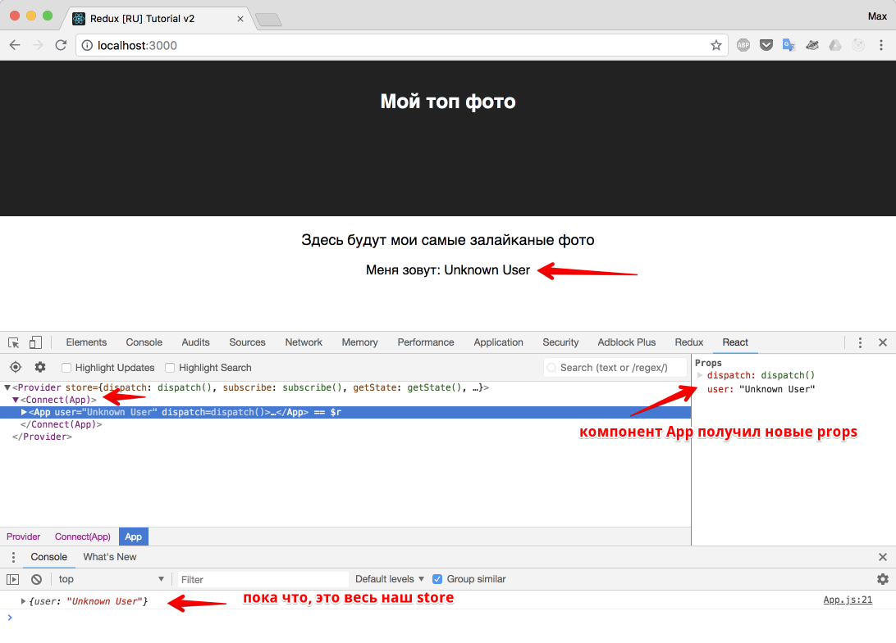

# Создание Reducer

Создадим "корневой редьюсер" (`rootReducer`).

_src/reducers/index.js_

```js
export const initialState = {
  user: 'Unknown User',
};

export function rootReducer(state = initialState) {
  return state;
}
```

В этой функции нечего комментировать. Просто возвращается `{user: 'Unknown User'}` (неизвестный пользователь).

В дальнейшем мы будем комбинировать редьюсеры в корневом редьюсере, но сейчас нам важно отобразить имя юзера (Unknown User) в компоненте, чтобы вы не заскучали от чтения.

Главное, что нужно сейчас держать в голове: корневой редьюсер - это и есть представление всего нашего состояния приложения (то есть, всего нашего `store`).

Сконфигурируем `store`:

_src/store/configureStore.js_

```js
import { createStore } from 'redux';
import { rootReducer, initialState } from '../reducers';

export const store = createStore(rootReducer, initialState);
```

Не забывайте, синтаксис функции `createStore`:

- первый аргумент - функция-обработчик изменений (редьюсер)
- второй аргумент - начальное состояние

## Связывание данных из store с компонентами приложения

В разделе [Точка входа](tochka-vhoda.md) шла речь о некой функции `connect`, которая поможет нам получить в качестве `props` для компонента `<App />` данные из `store`. Добавим ее:

_src/App.js_

```js
import React, { Component } from 'react';
import { connect } from 'react-redux';
import './App.css';

class App extends Component {
  render() {
    return (
      <div className="App">
        <header className="App-header">
          <h1 className="App-title">Мой топ фото</h1>
        </header>
        <p className="App-intro">
          Здесь будут мои самые залайканые фото
        </p>
        <p>Меня зовут: {this.props.user}</p>{' '}
        {/* добавлен вывод из props */}
      </div>
    );
  }
}

// приклеиваем данные из store
const mapStateToProps = (store) => {
  console.log(store); // посмотрим, что же у нас в store?
  return {
    user: store.user,
  };
};

// в наш компонент App, с помощью connect(mapStateToProps)
export default connect(mapStateToProps)(App);
```

Назначение функции `connect` вытекает из названия: подключи React компонент к Redux store.

Результат работы функции `connect` - новый присоединенный компонент, который оборачивает переданный компонент.

У нас был компонент `<App />`, а на выходе получился `<Connected(App)>`. В этом не трудно убедиться, если взглянуть в react dev tools.



Взгляните на правую часть скриншота, и вы увидите, что в свойствах (`props`) нашего компонента `<App />` теперь есть метод redux store - `dispatch`, и объект свойств (в нашем случае, пока что строка) `user`. Это так же результат работы функции `connect`.

Давайте еще поиграемся с простым примером. Для начала изменим набор данных:

_src/reducers/index.js_

```js
export const initialState = {
  user: {
    // мы вложили в user вместо строки, объект
    name: 'Василий',
    surname: 'Реактов',
    age: 27,
  },
};

export function rootReducer(state = initialState) {
  return state;
}
```

затем подкрутим компонент:

_src/containers/App.js_

```js
// ... (импорты)

class App extends Component {
  render() {
    const { name, surname, age } = this.props.user;
    return (
      <div className="App">
        <header className="App-header">
          <h1 className="App-title">Мой топ фото</h1>
        </header>
        <p>
          Привет из App, {name} {surname}!
        </p>
        <p>Тебе уже {age} ?</p>
      </div>
    );
  }
}

// ... (mapStateToProps и connect - не изменились)
```

Все работает ровно так, как мы указали: в объект `user` "подключилось" все состояние нашего приложения, которое сейчас очень простое и описано в `src/reducer/index.js`.


Итого: мы научились "вытаскивать" данные из стора в компонент, с помощью `connect`.

[Исходный код](https://github.com/maxfarseer/redux-course-ru-v2/tree/chp4-reducers-and-connect) на текущий момент.

Прежде чем мы перейдем к созданию actions и взаимодействию пользователя со страницей, давайте поговорим о комбинировании редьюсеров (`combineReducers`) и создадим реальную структуру нашего будущего приложения в следующем уроке.
