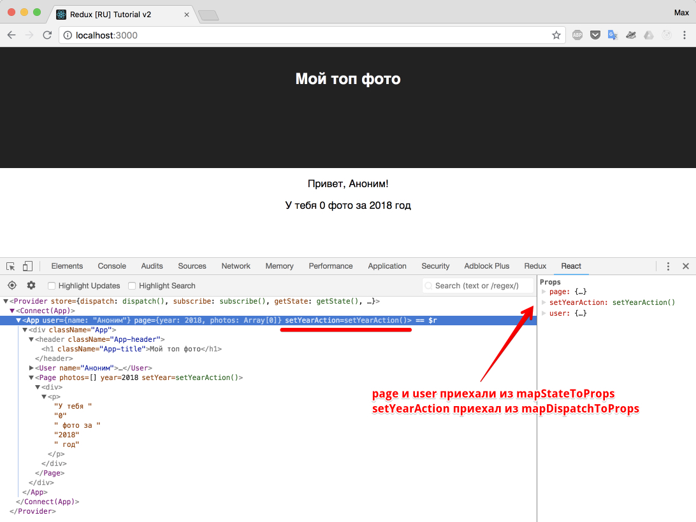

# Создание actions

Наконец-то мы подходим к вопросу взаимодействия пользователя с приложением. Практически любое действие пользователя в интерфейсе = отправка действия (dispatch actions)

В нашем приложении по клику на кнопку года мы должны:

- установить заголовок
- загрузить фото этого года из VK

Сейчас предлагаю рассмотреть установку заголовка, так как загрузка фото требует выполнения асинхронного запроса, а чтобы добраться до этого, мы должны рассмотреть несколько интересных вещей. К тому же, установка заголовка отлично показывает на простом примере, как вращаются данные внутри redux-приложения, а именно:

1. Приложение получило начальное состояние (initial state)
2. Пользователь нажав кнопку, отправил действие (dispatch action)
3. Соответсвующий редьюсер обновил часть приложения, в согласии с тем, что узнал от действия.
4. Приложение изменилось и теперь отражает новое состояние.
5. ... (все повторяется по кругу, с пункта 2)

Это и есть однонаправленный поток данных.

Создадим page actions (действия для сущности `page`):

_src/actions/PageActions.js_

```js
export function setYear(year) {
  return {
    type: 'SET_YEAR',
    payload: year,
  };
}
```

Напоминаю, что поле `type` - обязательное, а `payload` - "негласное" соглашение.

Научим редьюсер `page` реагировать на наше действие:

_src/reducers/page.js_

```js
const initialState = {
  year: 2018,
  photos: [],
};

export function pageReducer(state = initialState, action) {
  switch (action.type) {
    case 'SET_YEAR':
      return { ...state, year: action.payload };

    default:
      return state;
  }
}
```

Обратите внимание, в аргументах у функции page указан второй аргумент - `action`. Это стандартные аргументы redux reducer'а. Благодаря этому, мы можем обрабатывать различные действия по их типу, попадая в нужную секцию case оператора `switch`.

Так же обратите внимание, что мы не изменили объект `state`, а вернули новый с полем `year` равным `action.payload` (а значит годом, выбранным пользователем, который был послан в `action.payload`).

## Добавляем вызов actions из компонентов

У нас есть `action`, и есть `reducer` готовый изменить `store` приложения. Но наш компонент не знает как обратиться к необходимому действию.

Согласно таблице из прошлого раздела: для изменения данных, наш компонент `<Page />`, должен вызывать callback из `this.props`, а наш контейнер (я говорю контейнер, хотя правильнее называть контейнером `<Connect(App) />`, но так как он генерируется функцией `connect` на основе `App.js`, считаю это допустимым.) `<App />` - отправлять действие (dispatch action).

Из документации функции `connect`, мы видим, что с помощью этой функции можно не только подписаться на обновления данных (`mapStateToProps`), но и "прокинуть" наши `actions` в контейнер (`mapDispatchToProps`).

`connect`, первым аргументом принимает "маппинг" (соответствие) `state` к `props`, а вторым маппинг `dispatch` к `props`. Как бы дико это не звучало, на практике это значит, что нам достаточно передать второй аргумент.

Исправим `App.js`

_src/containers/App.js_

```js
import React, { Component } from 'react';
import { connect } from 'react-redux';
import { User } from '../components/User';
import { Page } from '../components/Page';
import { setYear } from '../actions/PageActions';

import './App.css';

class App extends Component {
  render() {
    const { user, page, setYearAction } = this.props;
    return (
      <div className="App">
        <header className="App-header">
          <h1 className="App-title">Мой топ фото</h1>
        </header>
        <User name={user.name} />
        <Page
          photos={page.photos}
          year={page.year}
          setYear={setYearAction}
        />
      </div>
    );
  }
}

const mapStateToProps = (store) => {
  return {
    user: store.user,
    page: store.page,
  };
};

const mapDispatchToProps = (dispatch) => {
  return {
    setYearAction: (year) => dispatch(setYear(year)), // [1]
  };
};

export default connect(
  mapStateToProps,
  mapDispatchToProps
)(App);
```

Начнем с разбора `mapDispatchToProps`. Данная функция, первым аргументом получает `dispatch`, а значит мы можем теперь "диспатчить" экшены, которые будут пойманы редьюсером. Еще раз:только те экшены, которые были отправлены с помощью "диспетчера" будут пойманы редьюсером.

Затем мы внутри `mapDispatchToProps` вернули объект, который в итоге приклеится в `this.props` (так же, как и было в `mapStateToProps`).

И в конце, мы решили в "приклееном объекте" создать функцию `setYearAction`, суть которой сводится к следующему: "диспатчни" импортированный выше `setYear` с переданным годом.

Обычно пишут без добавления `Action: setYear: year => dispatch(setYear(year))`, но я хотел бы уменьшить путаницу для тех людей, кто не силен в основах JavaScript (а зря!) и сейчас может быстро запутаться.

Так же я пишу `return`, для того, чтобы вы могли удобно сконсолить значения аргументов, если вам что-то не понятно. Без `return`, можно написать так:

```js
const mapDispatchToProps = (dispatch) => ({
  setYearAction: (year) => dispatch(setYear(year)),
});
```

После выполнения `connect(mapStateToProps, mapDispatchToProps)(App)`, мы получили в `<App />` новые свойства (`props`), что наглядно демонстрирует вкладка "React" в chrome dev tools.



Добавив `setYear` в свойства `<Page />`, не составит труда использовать необходимый `action` из компонента, который по прежнему знать ничего не знает о redux.

Добавим несколько кнопок с годами и обработчик клика на них, в котором будем считывать название года с самой кнопки и отправлять его с помощью экшена `'SET_YEAR'` прямиком в редьюсер `page`.

_src/components/Page.js_

```js
import React from 'react';
import PropTypes from 'prop-types';

export class Page extends React.Component {
  onBtnClick = (e) => {
    const year = +e.currentTarget.innerText;
    this.props.setYear(year);
  };
  render() {
    const { year, photos } = this.props;
    return (
      <div>
        <div>
          <button onClick={this.onBtnClick}>2018</button>
          <button onClick={this.onBtnClick}>2017</button>
          <button onClick={this.onBtnClick}>2016</button>
          <button onClick={this.onBtnClick}>2015</button>
          <button onClick={this.onBtnClick}>2014</button>
        </div>
        <p>
          У тебя {photos.length} фото за {year} год
        </p>
      </div>
    );
  }
}

Page.propTypes = {
  year: PropTypes.number.isRequired,
  photos: PropTypes.array.isRequired,
  setYear: PropTypes.func.isRequired, // добавили новое свойство в propTypes
};
```

Сейчас если кликнуть на кнопку с годом, то в приложении год будет изменяться. Вау?)

Что происходит: по клику на кнопку, вызывается переданное в свойствах функция, в которой диспатчится экшен (с типом `SET_YEAR` и годом). Затем, так как этот экшен был "диспатчнут" он пролетает через все редьюсеры (у нас их два: `user` и `page`). Так как в `page` есть `case 'SET_YEAR'` - редьюсер возвращает новое состояние, а именно - берет все что было в нашем `state` (по факту - все что было в данном "куске пирога" от стора связанное с `page`) и возвращает новое значение года:

```js
case 'SET_YEAR':
return { ...state, year: action.payload }
```

Затем, так как год изменился, в компоненте `<App />` случилось обновление, так как внутри `mapStateToProps` мы подписаны на изменение данных из редьюсера `page`. Раз случилось обновление, значит перерисовались все потомки и в том числе, в компонент `<Page />` ушло новое значение года.

p.s. в коде было использовано свойство DOM-элемента `textContent`

p.p.s. можете добавить `console.log(store)` в `mapStateToProps` и посмотреть есть ли новые данные.

```js
const mapStateToProps = (store) => {
  console.log(store);
  return {
    user: store.user,
    page: store.page,
  };
};
```


Глава выдалась достаточно длинной, а хуже всего, что мы написали "кипу" кода, всего лишь для обновления цифры в заголовке. Где профит, как говорится?

Профит обнаружится дальше, когда ваше приложение разрастется. Когда его будет необходимо поддерживать и добавлять новые фичи. За счет однонаправленного потока данных (юзер кликнул - действие вызвалось - редьюсер изменил состояние - компонент отрисовал изменения) даже в приложении, написанном давно, у вас получится очень быстро разобраться и внести необходимые обновления, которые требует бизнес.

Итого: мы научились обновлять Redux-приложение правильно: диспатчить экшен и реагировать на экшен в редьюсере.

[Искодный код](https://github.com/maxfarseer/redux-course-ru-v2/tree/chp7-create-actions)
