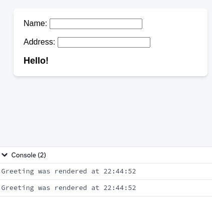
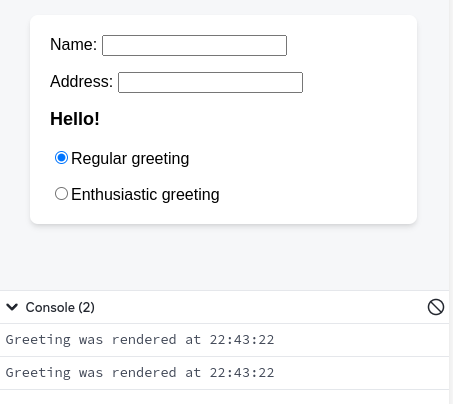
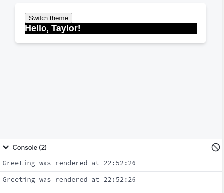

# memo

`memo` позволяет пропустить повторное отображение компонента, если его пропсы неизменны.

```js
const MemoizedComponent = memo(SomeComponent, arePropsEqual?)
```

## Описание

### `memo(Component, arePropsEqual?)`

Оберните компонент в `memo`, чтобы получить _мемоизированную_ версию этого компонента. Эта мемоизированная версия вашего компонента обычно не будет перерисовываться при перерисовке его родительского компонента, если его пропсы не изменились. Но React все равно может его перерисовать: мемоизация - это оптимизация производительности, а не гарантия.

<!-- 0001.part.md -->

```js
import { memo } from 'react';

const SomeComponent = memo(function SomeComponent(props) {
    // ...
});
```

#### Параметры

-   `Компонент`: Компонент, который вы хотите мемоизировать. Функция `memo` не изменяет этот компонент, а возвращает новый, мемоизированный компонент. Принимается любой допустимый компонент React, включая функции и компоненты [`forwardRef`](./forwardRef.md).

-   **опциональная** `arePropsEqual`: Функция, принимающая два аргумента: предыдущий пропс компонента и его новый пропс. Она должна возвращать `true`, если старые и новые пропсы равны: то есть, если компонент будет выводить тот же результат и вести себя так же с новыми пропсами, как и со старыми. В противном случае он должен вернуть `false`. Обычно вы не указываете эту функцию. По умолчанию React будет сравнивать каждый пропс с [`Object.is`.](https://developer.mozilla.org/docs/Web/JavaScript/Reference/Global_Objects/Object/is).

#### Возвращает

`memo` возвращает новый компонент React. Он ведет себя так же, как и компонент, переданный в `memo`, за исключением того, что React не будет всегда перерисовывать его, когда перерисовывается его родитель, если его пропсы не изменились.

## Использование

### Пропуск повторного рендеринга при неизменных пропсах

React обычно перерисовывает компонент каждый раз, когда перерисовывается его родитель. С помощью `memo` вы можете создать компонент, который React не будет перерисовывать при перерисовке его родителя до тех пор, пока его новые пропсы будут такими же, как и старые. Такой компонент называется _memoized_.

Чтобы сделать компонент мемоизированным, оберните его в `memo` и используйте значение, которое он возвращает, вместо вашего оригинального компонента:

<!-- 0003.part.md -->

```js
const Greeting = memo(function Greeting({ name }) {
    return <h1>Hello, {name}!</h1>;
});

export default Greeting;
```

<!-- 0004.part.md -->

Компонент React всегда должен иметь [чистую логику рендеринга](../learn/keeping-components-pure.md) Это означает, что он должен возвращать тот же результат, если его пропсы, состояние и контекст не изменились. Используя `memo`, вы сообщаете React, что ваш компонент соответствует этому требованию, поэтому React не нужно выполнять повторный рендеринг, пока его пропсы не изменились. Даже с `memo` ваш компонент будет перерисовываться, если изменится его собственное состояние или если изменится контекст, который он использует.

В этом примере обратите внимание, что компонент `Greeting` перерисовывается при изменении `name` (потому что это один из его пропсов), но не при изменении `address` (потому что он не передается `Greeting` в качестве пропса):

=== "App.js"

    ```js
    import { memo, useState } from 'react';

    export default function MyApp() {
    	const [name, setName] = useState('');
    	const [address, setAddress] = useState('');
    	return (
    		<>
    			<label>
    				Name{': '}
    				<input
    					value={name}
    					onChange={(e) =>
    						setName(e.target.value)
    					}
    				/>
    			</label>
    			<label>
    				Address{': '}
    				<input
    					value={address}
    					onChange={(e) =>
    						setAddress(e.target.value)
    					}
    				/>
    			</label>
    			<Greeting name={name} />
    		</>
    	);
    }

    const Greeting = memo(function Greeting({ name }) {
    	console.log(
    		'Greeting was rendered at',
    		new Date().toLocaleTimeString()
    	);
    	return (
    		<h3>
    			Hello{name && ', '}
    			{name}!
    		</h3>
    	);
    });
    ```

=== "Результат"

    

!!!note ""

    **Вы должны полагаться на `memo` только в качестве оптимизации производительности.** Если ваш код не работает без него, найдите основную проблему и сначала устраните ее. Затем вы можете добавить `memo` для улучшения производительности.

!!!note "Должны ли вы добавлять memo везде?"

    Если ваше приложение похоже на этот сайт, и большинство взаимодействий являются грубыми (например, замена страницы или целого раздела), мемоизация обычно не нужна. С другой стороны, если ваше приложение больше похоже на редактор рисунков, и большинство взаимодействий являются гранулированными (например, перемещение фигур), то мемоизация может оказаться очень полезной.

    Оптимизация с помощью `memo` имеет смысл только в том случае, если ваш компонент часто перерисовывается с одними и теми же пропсами, и логика перерисовки требует больших затрат. Если нет ощутимой задержки при рендеринге компонента, `memo` не нужен. Помните, что `memo` совершенно бесполезно, если пропсы, передаваемые вашему компоненту, _всегда разные_, например, если вы передаете объект или простую функцию, определенную во время рендеринга. Вот почему вам часто понадобится [`useMemo`](useMemo.md) и [`useCallback`](useCallback.md) вместе с `memo`.

    В других случаях нет никакой пользы от обертывания компонента в `memo`. Вреда от этого тоже нет, поэтому некоторые команды предпочитают не думать об отдельных случаях и мемоизировать как можно больше. Недостатком такого подхода является то, что код становится менее читабельным. Кроме того, не вся мемоизация эффективна: одного значения, которое "всегда новое", достаточно, чтобы нарушить мемоизацию для всего компонента.

    **На практике вы можете сделать ненужной мемоизацию, следуя нескольким принципам:**.

    1.  Когда компонент визуально обертывает другие компоненты, позвольте ему [принимать JSX в качестве дочерних компонентов](../learn/passing-props-to-a-component.md) Таким образом, когда компонент-обертка обновляет свое собственное состояние, React знает, что его дочерние компоненты не нужно перерисовывать.
    2.  Предпочитайте локальное состояние и не [поднимайте состояние вверх](../learn/sharing-state-between-components.md) дальше, чем это необходимо. Например, не храните переходные состояния, такие как формы и то, наведен ли элемент на вершину вашего дерева, в глобальной библиотеке состояний.
    3.  Сохраняйте чистоту [логики рендеринга](../learn/keeping-components-pure.md) Если повторный рендеринг компонента вызывает проблему или приводит к заметным визуальным артефактам, это ошибка в вашем компоненте! Исправьте ошибку вместо того, чтобы добавлять мемоизацию.
    4.  Избегайте [ненужных Эффектов, обновляющих состояние](../learn/you-might-not-need-an-effect.md) Большинство проблем с производительностью в приложениях React вызваны цепочками обновлений, исходящих от Эффектов, которые заставляют ваши компоненты рендериться снова и снова.
    5.  Попробуйте [удалить ненужные зависимости из ваших Эффектов](../learn/removing-effect-dependencies.md). Например, вместо мемоизации часто проще переместить какой-то объект или функцию внутрь Эффекта или за пределы компонента.

    Если конкретное взаимодействие по-прежнему работает с задержками, используйте [профилировщик React Developer Tools](https://legacy.reactjs.org/blog/2018/09/10/introducing-the-react-profiler.html), чтобы узнать, какие компоненты больше всего выиграют от мемоизации, и добавьте мемоизацию там, где это необходимо. Эти принципы облегчают отладку и понимание ваших компонентов, поэтому в любом случае полезно следовать им. В перспективе мы исследуем возможность [автоматической гранулярной мемоизации](https://www.youtube.com/watch?v=lGEMwh32soc), чтобы решить эту проблему раз и навсегда.

### Обновление мемоизированного компонента с помощью состояния

Даже если компонент мемоизирован, он все равно будет перерисовываться при изменении своего состояния. Мемоизация имеет отношение только к пропсам, которые передаются компоненту от его родителя.

=== "App.js"

    ```js
    import { memo, useState } from 'react';

    export default function MyApp() {
    	const [name, setName] = useState('');
    	const [address, setAddress] = useState('');
    	return (
    		<>
    			<label>
    				Name{': '}
    				<input
    					value={name}
    					onChange={(e) =>
    						setName(e.target.value)
    					}
    				/>
    			</label>
    			<label>
    				Address{': '}
    				<input
    					value={address}
    					onChange={(e) =>
    						setAddress(e.target.value)
    					}
    				/>
    			</label>
    			<Greeting name={name} />
    		</>
    	);
    }

    const Greeting = memo(function Greeting({ name }) {
    	console.log(
    		'Greeting was rendered at',
    		new Date().toLocaleTimeString()
    	);
    	const [greeting, setGreeting] = useState('Hello');
    	return (
    		<>
    			<h3>
    				{greeting}
    				{name && ', '}
    				{name}!
    			</h3>
    			<GreetingSelector
    				value={greeting}
    				onChange={setGreeting}
    			/>
    		</>
    	);
    });

    function GreetingSelector({ value, onChange }) {
    	return (
    		<>
    			<label>
    				<input
    					type="radio"
    					checked={value === 'Hello'}
    					onChange={(e) => onChange('Hello')}
    				/>
    				Regular greeting
    			</label>
    			<label>
    				<input
    					type="radio"
    					checked={value === 'Hello and welcome'}
    					onChange={(e) =>
    						onChange('Hello and welcome')
    					}
    				/>
    				Enthusiastic greeting
    			</label>
    		</>
    	);
    }
    ```

=== "Результат"

    

Если вы установите переменную состояния в ее текущее значение, React пропустит повторный рендеринг вашего компонента даже без `memo`. Вы можете увидеть, что функция компонента будет вызвана лишний раз, но результат будет отброшен.

### Обновление мемоизированного компонента с помощью контекста

Даже если компонент мемоизирован, он все равно будет перерисовываться при изменении контекста, который он использует. Мемоизация имеет отношение только к пропсам, которые передаются компоненту от его родителя.

=== "App.js"

    ```js
    import {
    	createContext,
    	memo,
    	useContext,
    	useState,
    } from 'react';

    const ThemeContext = createContext(null);

    export default function MyApp() {
    	const [theme, setTheme] = useState('dark');

    	function handleClick() {
    		setTheme(theme === 'dark' ? 'light' : 'dark');
    	}

    	return (
    		<ThemeContext.Provider value={theme}>
    			<button onClick={handleClick}>
    				Switch theme
    			</button>
    			<Greeting name="Taylor" />
    		</ThemeContext.Provider>
    	);
    }

    const Greeting = memo(function Greeting({ name }) {
    	console.log(
    		'Greeting was rendered at',
    		new Date().toLocaleTimeString()
    	);
    	const theme = useContext(ThemeContext);
    	return <h3 className={theme}>Hello, {name}!</h3>;
    });
    ```

=== "Результат"

    

Чтобы заставить ваш компонент перерисовываться только при изменении _части_ некоторого контекста, разделите ваш компонент на две части. Считывайте то, что вам нужно из контекста во внешнем компоненте, и передавайте это дочернему компоненту в виде пропса.

### Минимизация изменений пропсов

Когда вы используете `memo`, ваш компонент перерисовывается всякий раз, когда любой пропс не _мало равен_ тому, каким он был ранее. Это означает, что React сравнивает каждый пропс в вашем компоненте с его предыдущим значением, используя сравнение [`Object.is`](https://developer.mozilla.org/docs/Web/JavaScript/Reference/Global_Objects/Object/is). Обратите внимание, что `Object.is(3, 3)` - это `true`, а `Object.is({}, {})` - это `false`.

Чтобы получить максимальную отдачу от `memo`, минимизируйте время изменения пропса. Например, если пропс является объектом, не позволяйте родительскому компоненту каждый раз создавать этот объект заново, используя [`useMemo`:](useMemo.md)

<!-- 0018.part.md -->

```js
function Page() {
    const [name, setName] = useState('Taylor');
    const [age, setAge] = useState(42);

    const person = useMemo(() => ({ name, age }), [
        name,
        age,
    ]);

    return <Profile person={person} />;
}

const Profile = memo(function Profile({ person }) {
    // ...
});
```

<!-- 0019.part.md -->

Лучший способ минимизировать изменения пропсов - убедиться, что компонент принимает минимум необходимой информации в своих пропсах. Например, он может принимать отдельные значения вместо целого объекта:

<!-- 0020.part.md -->

```js
function Page() {
    const [name, setName] = useState('Taylor');
    const [age, setAge] = useState(42);
    return <Profile name={name} age={age} />;
}

const Profile = memo(function Profile({ name, age }) {
    // ...
});
```

<!-- 0021.part.md -->

Даже отдельные значения иногда могут быть спроецированы на те, которые меняются реже. Например, здесь компонент принимает булево значение, указывающее на наличие значения, а не само значение:

<!-- 0022.part.md -->

```js
function GroupsLanding({ person }) {
    const hasGroups = person.groups !== null;
    return <CallToAction hasGroups={hasGroups} />;
}

const CallToAction = memo(function CallToAction({
    hasGroups,
}) {
    // ...
});
```

<!-- 0023.part.md -->

Когда вам нужно передать функцию в memoized компонент, либо объявите ее вне вашего компонента, чтобы она никогда не изменялась, либо [`useCallback`](useCallback.md), чтобы кэшировать ее определение между повторными рендерингами.

### Указание пользовательской функции сравнения

В редких случаях может оказаться невозможным минимизировать изменения пропсов мемоизированного компонента. В этом случае вы можете предоставить пользовательскую функцию сравнения, которую React будет использовать для сравнения старых и новых пропсов вместо неглубокого равенства. Эта функция передается в качестве второго аргумента в `memo`. Она должна возвращать `true` только в том случае, если новые пропсы приведут к тому же результату, что и старые; в противном случае она должна возвращать `false`.

<!-- 0024.part.md -->

```js
const Chart = memo(function Chart({ dataPoints }) {
    // ...
}, arePropsEqual);

function arePropsEqual(oldProps, newProps) {
    return (
        oldProps.dataPoints.length ===
            newProps.dataPoints.length &&
        oldProps.dataPoints.every((oldPoint, index) => {
            const newPoint = newProps.dataPoints[index];
            return (
                oldPoint.x === newPoint.x &&
                oldPoint.y === newPoint.y
            );
        })
    );
}
```

<!-- 0025.part.md -->

Если вы это сделаете, используйте панель Performance в инструментах разработчика браузера, чтобы убедиться, что ваша функция сравнения действительно быстрее, чем повторное отображение компонента. Вы можете быть удивлены.

Когда вы проводите измерения производительности, убедитесь, что React работает в производственном режиме.

!!!warning ""

    Если вы предоставляете пользовательскую реализацию `arePropsEqual`, **вы должны сравнивать каждый пропс, включая функции.** Функции часто [перекрывают](https://developer.mozilla.org/docs/Web/JavaScript/Closures) пропсы и состояние родительских компонентов. Если вы вернете `true`, когда `oldProps.onClick !== newProps.onClick`, ваш компонент будет продолжать "видеть" пропсы и состояние из предыдущего рендера в своем обработчике `onClick`, что приведет к очень запутанным ошибкам.

    Избегайте глубоких проверок равенства внутри `arePropsEqual`, если вы не уверены на 100%, что структура данных, с которой вы работаете, имеет известную ограниченную глубину. **Глубокие проверки равенства могут стать невероятно медленными** и могут заморозить ваше приложение на много секунд, если кто-то позже изменит структуру данных.

## Устранение неполадок

### Мой компонент рендерит, когда пропс является объектом, массивом или функцией

React сравнивает старые и новые пропсы по принципу неглубокого равенства: то есть, он рассматривает, является ли каждый новый пропс по ссылке равным старому пропсу. Если вы создаете новый объект или массив при каждом повторном отображении родителя, то даже если отдельные элементы будут одинаковыми, React все равно посчитает их измененными. Аналогично, если вы создаете новую функцию при рендеринге родительского компонента, React будет считать его изменившимся, даже если функция имеет то же самое определение. Чтобы избежать этого, упростите пропсы или мемоизируйте пропсы в родительском компоненте.

<!-- 0026.part.md -->

## Ссылки

-   [https://react.dev/reference/react/memo](https://react.dev/reference/react/memo)
