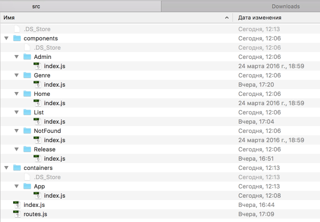
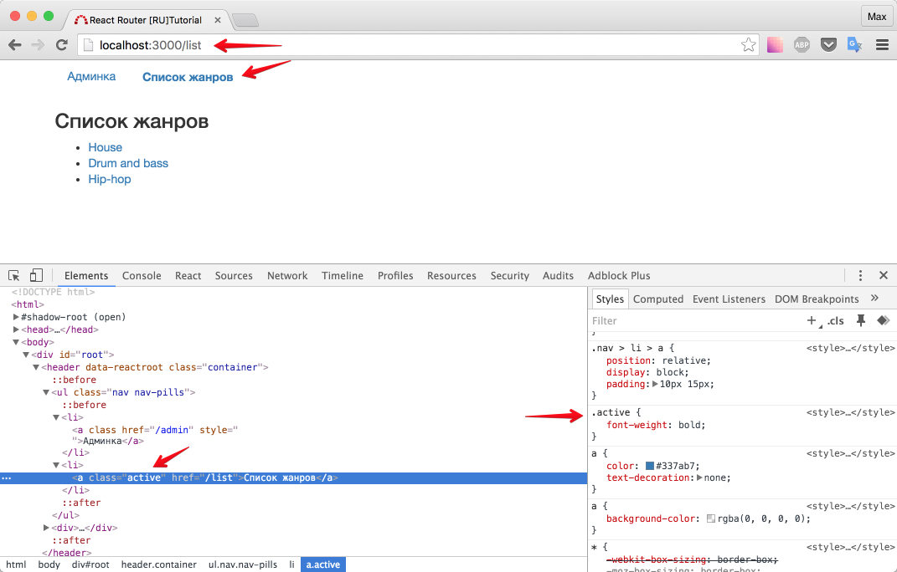
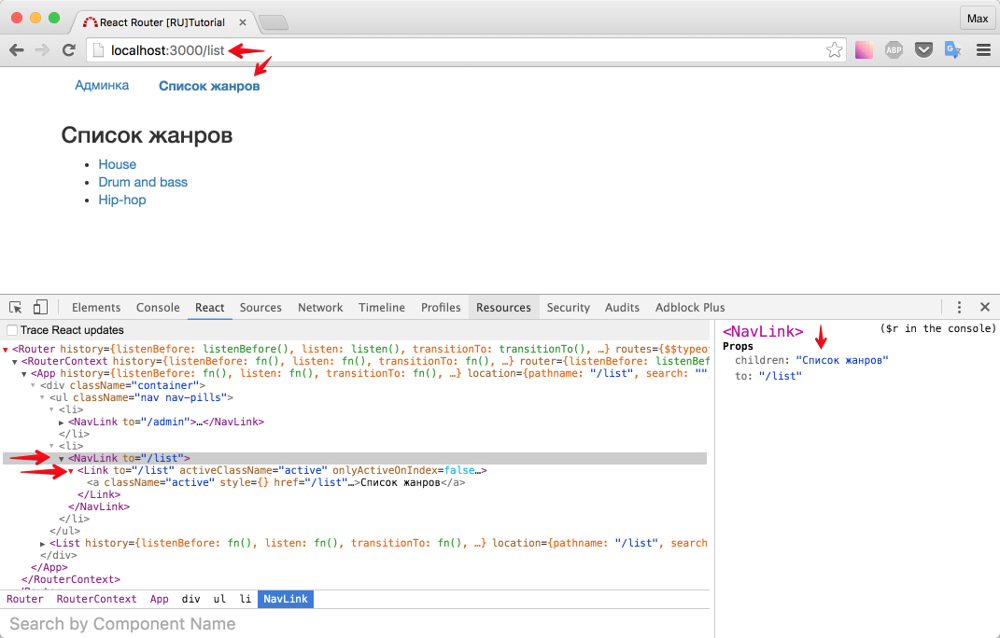

# Активная ссылка

Кто не мечтал подкрасить активную ссылку - тот не делал сайтов (ц) - народная мудрость.

Однако, чтобы подкрасить ссылку, нам нужно куда-то положить стили. Для этого, еще раз взглянем на любой компонент из проекта [redux-easy-boilerplate](https://github.com/anorudes/redux-easy-boilerplate/tree/master/src/components/Header): cтили положены вместе с компонентом. Предлагаю делать так же.

## Порефакторим

Создайте для всех компонентов свою директорию и положите в нее `index.js` файл. Файлы стилей будем добавлять по мере необходимости.

Необходимо создать директорию с названием, равным названию файла компонента, а сам файл компонента переименовать в `index.js`. В таком случае, не придется даже изменять что-то в подключении роутов.



Создадим файл стилей для компонента (контейнера) `<App />`

_src/containers/App/styles.scss_

```scss
.active {
  font-weight: bold;
}
```

Чтобы ссылка реагировала на активность, нужно добавить компоненту `<Link />` атрибут `activeClassName`. Например:

```js
<Link to="/list" activeClassName="active">
  Список жанров
</Link>
```

Важно не забыть импортировать файл стилей. Обработка scss в конфиге вебпака уже прописана, поэтому остается лишь изменить содержимое `<App />`:

_src/containers/App/index.js_

```js
import React, { Component } from 'react'
import { Link } from 'react-router'

import './styles.scss'

export default class App extends Component {
  render() {
    return (
      <div className="container">
        <ul className="nav nav-pills">
          <li>
            <Link to="/admin" activeClassName="active">
              Админка
            </Link>
          </li>
          <li>
            <Link to="/list" activeClassName="active">
              Список жанров
            </Link>
          </li>
        </ul>
        {this.props.children}
      </div>
    )
  }
}
```

Проверим?



[Туториал (EN)](https://github.com/reactjs/react-router-tutorial/tree/master/lessons/05-active-links#nav-link-wrappers) настаивает, чтобы я рассказал вам еще немного. Поэтому я приведу краткий перевод ниже.

## Навигационные ссылки

Обычно вам не нужно, чтобы ссылки на сайте умели быть активными/не активными. Это требуется только для навигационных ссылок. Чтобы не писать `activeClassName` "ручками", можно сделать обертку над компонентом `<Link />`.

Мы будем использовать [spread-оператор](https://github.com/sebmarkbage/ecmascript-rest-spread) (троеточие `...`, по-русски [здесь](https://developer.mozilla.org/ru/docs/Web/JavaScript/Reference/Operators/Spread_operator)). Он склонирует все `props`, а значит и `activeClassName`. То что нам нужно.

Создадим компонент `<NavLink />` (а так же, переместите `styles.scss` из `src/containers/App` в `src/components/NavLink`)

_src/components/NavLink/index.js_

```js
import React, { Component } from 'react'
import { Link } from 'react-router'

import './styles.scss'

export default class NavLink extends Component {
  render() {
    return <Link {...this.props} activeClassName="active" />
  }
}
```

Остается изменить `<App />`:

_src/containers/App/index.js_

```js
import React, { Component } from 'react'
import NavLink from '../../components/NavLink'

export default class App extends Component {
  render() {
    return (
      <div className="container">
        <ul className="nav nav-pills">
          <li>
            <NavLink to="/admin">Админка</NavLink>
          </li>
          <li>
            <NavLink to="/list">Список жанров</NavLink>
          </li>
        </ul>
        {this.props.children}
      </div>
    )
  }
}
```

(удалили импорт `<Link />`, добавили `<NavLink />`, заменили все вхождения `Link` на `NavLink`)

Посмотрим на результат:



Итого: чтобы ссылка "умела быть активной" - достаточно добавить `activeClassName` для компонента `<Link />`.

P.S. прием с оборачиванием компонента - очень мощный. Возьмите его на вооружение.

[Исходный код](https://github.com/maxfarseer/react-router-ru-tutorial/tree/active_link) на данный момент.
