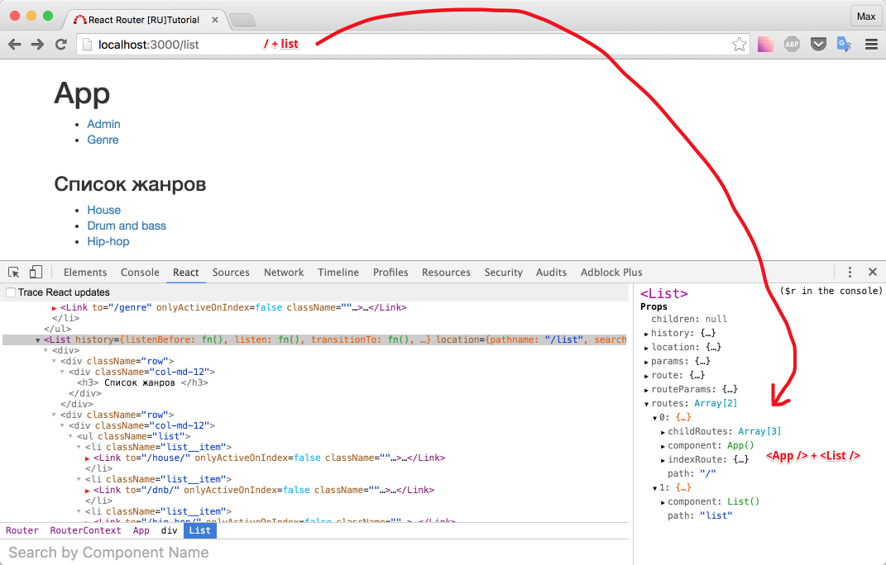
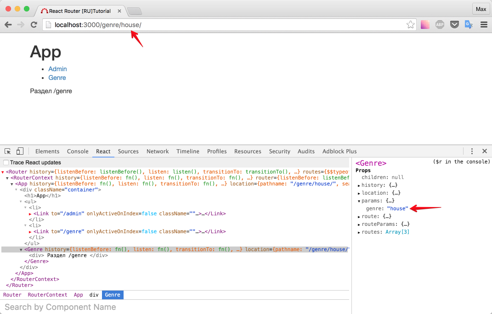
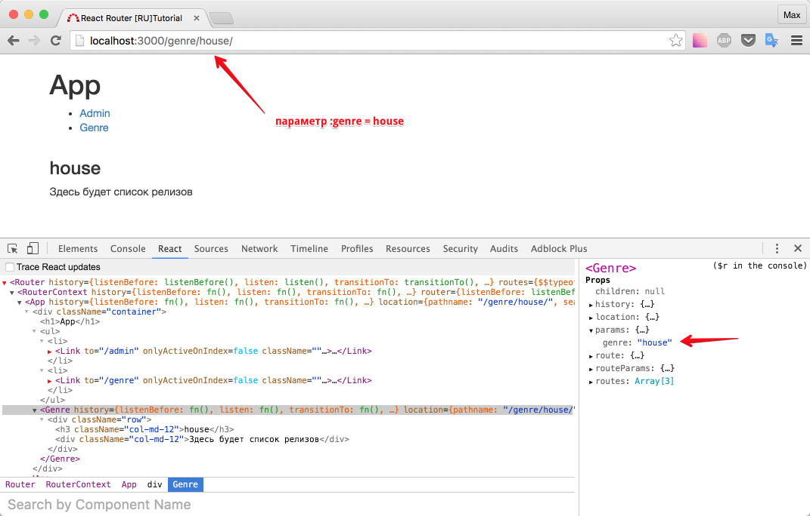
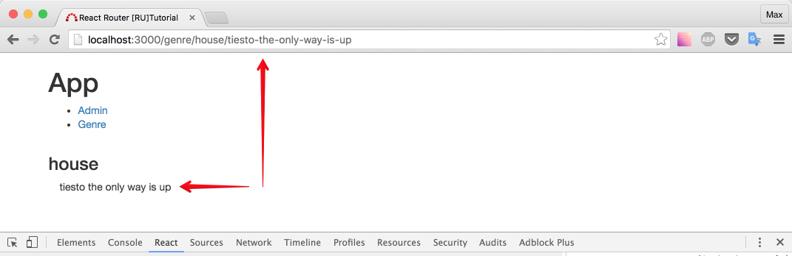

# Дописываем роуты

Пока я писал этот курс, вышел React 15, давайте обновим сразу `react` и `react-dom`.

Далее в курсе будут использованы следующие версии:

```json
"react": "^15.0.1",
"react-dom": "^15.0.1",
```

Давайте вспомним, какие роуты мы хотели сделать:

```
/ - главная страница
/list - список жанров
/genre/:genre/ - список релизов данного жанра
/genre/:genre/:release - информация о релизе
/admin - страница администратора
```

Каждый раз, задача будет примерно такой:

- нужно создать компонент (и рендерить в нем детей, если есть дочерние url'ы)
- добавить компонент, как новый `Route`

Начнем с простого - роут, не имеющий детей - `/list`

_src/components/List.js_

```js
import React, { Component } from 'react'
import { Link } from 'react-router'

export default class List extends Component {
  render() {
    return (
      <div>
        <div className="row">
          <div className="col-md-12">
            <h3> Список жанров </h3>
          </div>
        </div>
        <div className="row">
          <div className="col-md-12">
            <ul className="list">
              <li className="list__item">
                <Link to="/genre/house/">House</Link>
              </li>
              <li className="list__item">
                <Link to="/genre/dnb/">Drum and bass</Link>
              </li>
              <li className="list__item">
                <Link to="/genre/hip-hop/">Hip-hop</Link>
              </li>
            </ul>
          </div>
        </div>
      </div>
    )
  }
}
```

Обновим информацию о роутах: `src/index.js`

```js
...
import List from './components/List'
...

    <Route path='/' component={App}>
      <IndexRoute component={Home} />
      <Route path='admin' component={Admin} />
      <Route path='genre' component={Genre} />
      <Route path='list' component={List} />
    </Route>
...
```

P.S. в данный момент у нас не поддерживается hot-reload для роутинга. Поэтому придется обновлять браузер по старинке.

Будьте внимательны, я специально привожу не полный код, чтобы вы не страдали copy-paste.

`<List />` - дочерний компонент `<App />`, (посмотрите на URL - `/` + `list` = две части, в переводе на react-router, это `<App />` + `this.props.children`, и конкретно в нашем случае это `<App />` + `<List />`)

Проверим в браузере:



Обратите внимание, что у `<App />` - `childRoutes: Array[3]`, именно этими детьми и являются `<Admin />`, `<Genre />` и `<List />` в данный момент. То есть, снова никакой магии.

Так же, обратите внимание сколько свойств "прокидывает" `react-router`. Это нам еще пригодится.

Кстати, если сейчас кликнуть по ссылке, например House, что отобразит браузер?

Ответ - отобразится компонент `<NotFound />`.

Покликав на ссылки, у нас вырисовываются следующие адреса:

```
http://localhost:3000/genre/house/
http://localhost:3000/genre/dnb/
http://localhost:3000/genre/hip-hop/
```

Для всех этих адресов, требуется отрисовывать один и тот же компонент, который будет отображать список релизов данного жанра. Как быть? Пора познакомиться с динамическим адресом.

## Динамический роут

Все очень просто. Сразу к делу. Изменим в `src/index.js`:

```js
<Route path="genre" component={Genre} />
```

на

```js
<Route path="genre/:genre" component={Genre} />
```

Обновите браузер:



Отображается компонент `<Genre />`, при этом в `props` появилось свойство `params`, давайте сразу возьмем его в оборот:

_src/components/Genre.js_

```js
import React, { Component } from 'react'

export default class Genre extends Component {
  render() {
    return (
      <div className="row">
        <h3 className="col-md-12">
          {this.props.params.genre}
        </h3>
        <div className="col-md-12">
          Здесь будет список релизов
        </div>
      </div>
    )
  }
}
```



Если попробовать ввести вместо `house` другое слово - все так же будет работать.

Будем называть динамическую часть url'a - параметром. То есть `:genre` - параметр.

Нет никакого ограничения на количество параметров в адресе. Например:

```
localhost:3000/:param_one/not_param/:param_two/:param_three
```

Задача: создать компонент , который будет доступен по адресу:

```
localhost:3000/genre/house/tiesto-the-only-way-is-up
```

и будет выглядеть так:



Подсказка #1: Необходимо использовать `nesting` (вложения), а значит - потребуется рендерить `this.props.children`

Решение:

_src/index.js_

```js
...

import Release from './components/Release'

...
  <Router history={browserHistory}>
    <Route path='/' component={App}>
      <IndexRoute component={Home} />
      <Route path='admin' component={Admin} />
      <Route path='genre/:genre' component={Genre}>
           {/* добавили новый route */}
        <Route path=':release' component={Release} />
      </Route>
      <Route path='list' component={List} />
    </Route>
    <Route path='*' component={NotFound} />
  </Router>,
...
```

_src/components/Genre.js_

```js
import React, { Component } from 'react'

export default class Genre extends Component {
  render() {
    let template
    {
      /* если параметр release есть - покажи дочерний компонент */
    }
    if (this.props.params.release) {
      template = (
        <div className="row">
          <h3 className="col-md-12">
            {this.props.params.genre}
          </h3>
          <div className="col-md-12">
            {this.props.children}
          </div>
        </div>
      )
    } else {
      template = (
        <div className="row">
          <h3 className="col-md-12">
            {this.props.params.genre}
          </h3>
          <div className="col-md-12">
            Здесь будет список релизов
          </div>
        </div>
      )
    }

    return template
  }
}
```

_src/components/Release.js_

```js
import React, { Component } from 'react'

export default class Release extends Component {
  render() {
    {
      /* замени все '-' в параметре (то есть в адресе) на пробелы */
    }
    const releaseName = this.props.params.release.replace(
      /-/g,
      ' '
    )
    return <div className="col-md-12">{releaseName}</div>
  }
}
```

С параметром мы можем работать как с любым другим свойством.

## Оформление routes

Чем глубже уровень вложение в роутах, тем сложнее сразу понять какому роуту соответствует тот или иной компонент. Поэтому, мы можем указать путь полностью:

```js
<Route path="/" component={App}>
  <IndexRoute component={Home} />
  <Route path="/admin" component={Admin} />
  <Route path="/genre/:genre" component={Genre}>
    <Route
      path="/genre/:genre/:release"
      component={Release}
    />
  </Route>
  <Route path="/list" component={List} />
</Route>
```

Так же, давайте вынесем `routes` в отдельный файл.

_src/routes.js_

```js
import React from 'react'
import { Route, IndexRoute } from 'react-router'

import App from './containers/App'
import Admin from './components/Admin'
import List from './components/List'
import Genre from './components/Genre'
import Release from './components/Release'
import Home from './components/Home'
import NotFound from './components/NotFound'

export const routes = (
  <div>
    <Route path="/" component={App}>
      <IndexRoute component={Home} />
      <Route path="/admin" component={Admin} />
      <Route path="/genre/:genre" component={Genre}>
        <Route
          path="/genre/:genre/:release"
          component={Release}
        />
      </Route>
      <Route path="/list" component={List} />
    </Route>
    <Route path="*" component={NotFound} />
  </div>
)
```

Так как routes - реакт компонент, и мы используем `<NotFound />` не в качестве дочернего компонента (чтобы не было "шапки"), нам пришлось обернуть роуты в `<div>`. Вы можете сделать иначе, если хотите, чтобы шапка (сейчас это ссылки Admin и Genre) была на всех страницах, включая 404.

Обновим код для подключения роутов:

_src/index.js_

```js
import 'babel-polyfill'
import React from 'react'
import { render } from 'react-dom'
import { Router, browserHistory } from 'react-router'
import { routes } from './routes'

render(
  <Router history={browserHistory} routes={routes} />,
  document.getElementById('root')
)
```

## Приберемся

У нас появилась нерабочая ссылка в шапке - Genre. Так как она нам больше не нужна, давайте заменим ее на 'Список жанров' и будем отображать компонент `<List />` по клику на эту ссылку.

Заодно переименуем Admin. Удалим заголовок App и накинем парочку bootstrap классов тэгу `<ul>`.

_src/containers/App.js_

```js
import React, { Component } from 'react'
import { Link } from 'react-router'

export default class App extends Component {
  render() {
    return (
      <div className="container">
        <ul className="nav nav-pills">
          <li>
            <Link to="/admin">Админка</Link>
          </li>
          <li>
            <Link to="/list">Список жанров</Link>
          </li>
        </ul>
        {this.props.children}
      </div>
    )
  }
}
```

Проверьте в браузере, покликайте по ссылкам. Понажимайте вперед/назад.

Итого: мы рассмотрели как можно создать динамический роут, и как можно использовать динамическую часть в шаблоне компонента.

[Исходный код](https://github.com/maxfarseer/react-router-ru-tutorial/tree/edit_routes_v2) на данный момент (комментарии удалены)
