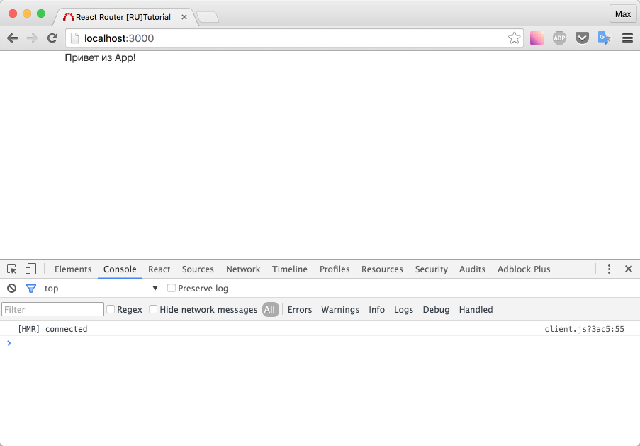

# Настраиваем dev-окружение

Если вы не хотите заниматься настройкой окружения, а хотите сразу перейти к урокам по react-router'у, возьмите этот [исходный код](https://github.com/maxfarseer/react-router-ru-tutorial/tree/setupd_dev_env).

Что мы получим в итоге?

- React + перезагрузка страницы при возникновении изменений в коде компонентов (стилей в том числе)
- [Bootstrap](http://getbootstrap.com/) (и [jQuery](https://jquery.com/) в качестве примера добавления библиотеки. В учебнике jQuery не используется)
- [SASS](http://sass-lang.com/)
- Возможность писать ES2015/ES7 код
- Линтинг (проверку) нашего кода с помощью [ESLint](http://eslint.org/)
- Наброски для development и production версий.

Текст ниже не является обязательным для прочтения, достаточно скачать архив и выполнить npm install. В будущем мы установим [react-router](https://github.com/reactjs/react-router), поэтому вы точно ничего не "потеряете".

За основу был взят проект [redux-easy-boilerplate](https://github.com/anorudes/redux-easy-boilerplate).

## Изменения/Обновления

В процессе написания учебника "случился" отпуск. Да и новые версии выходят постоянно. Я старался обновляться по мере возможностей или в силу необходимых обстоятельств. Ниже будет список.

1. webpack в хроме выдавал слишком много "предупреждений" (из-за source maps). Обновился до webpack@1.13.0
2. обновил react и react-dom

```
"react": "^15.0.1",
"react-dom": "^15.0.1"
```

## Подробнее о настройке

Все как обычно начинается с `package.json`

```json
{
  "name": "react-router-ru-tutorial",
  "version": "1.0.0",
  "description": "React-router RU tutorial",
  "main": "index.js",
  "scripts": {
    "start": "node bin/server.js"
  },
  "author": "Maxim Patsianskiy",
  "license": "MIT",
  "devDependencies": {
    "autoprefixer": "^6.3.3",
    "babel-core": "^6.7.2",
    "babel-eslint": "^5.0.0",
    "babel-loader": "^6.2.4",
    "babel-polyfill": "^6.7.2",
    "babel-preset-es2015": "^6.6.0",
    "babel-preset-react": "^6.5.0",
    "babel-preset-react-hmre": "^1.1.1",
    "babel-preset-stage-0": "^6.5.0",
    "bootstrap-loader": "^1.0.9",
    "bootstrap-sass": "^3.3.6",
    "css-loader": "^0.23.1",
    "eslint": "^2.4.0",
    "eslint-loader": "^1.3.0",
    "eslint-plugin-react": "^4.2.3",
    "estraverse-fb": "^1.3.1",
    "extract-text-webpack-plugin": "^1.0.1",
    "file-loader": "^0.8.5",
    "imports-loader": "^0.6.5",
    "node-sass": "^3.4.2",
    "postcss-import": "^8.0.2",
    "postcss-loader": "^0.8.2",
    "resolve-url-loader": "^1.4.3",
    "sass-loader": "^3.2.0",
    "style-loader": "^0.13.0",
    "url-loader": "^0.5.7",
    "webpack": "^1.12.14",
    "webpack-dev-middleware": "^1.5.1",
    "webpack-dev-server": "^1.14.1",
    "webpack-hot-middleware": "^2.10.0",
    "webpack-merge": "^0.8.3"
  },
  "dependencies": {
    "jquery": "^2.2.1",
    "react": "^0.14.7",
    "react-dom": "^0.14.7"
  }
}
```

Обратите внимание, в списке зависимостей нет ни `react-router`, ни даже `redux`, зато есть `jQuery` и `Bootstrap`. Собственно, `jQuery` - это зависимость `Bootstrap`. Реакт-роутер и редукс будут добавлены позже, как и другие необходимые пакеты.

Начнем распутывать "клубок".

Как видно из `package.json` приложение будем "стартовать" командой `npm start`, которая в свою очередь выполнит `node bin/server.js`

_bin/server.js_

```js
var fs = require('fs')

var babelrc = fs.readFileSync('./.babelrc')
var config

try {
  config = JSON.parse(babelrc)
} catch (err) {
  console.error('==> ERROR: Error parsing your .babelrc.')
  console.error(err)
}

require('babel-core/register')(config)
require('../server')
```

Благодаря такой "обертке" мы убьем сразу несколько зайцев:

- сможем выдавать красивое сообщение об ошибке, если не хватает какого-то из babel-preset'ов
- сможем код файла по адресу `../server` относительно текущего (напомню, текущий - это `bin/server.js`) писать на ES2015

Давайте создадим "этот самый файл" по адресу `../server`.

_server.js_

```js
const http = require('http');
const express = require('express');
const app = express();

(function initWebpack() {
    const webpack = require('webpack');
    const webpackConfig = require('./webpack/common.config');
    const compiler = webpack(webpackConfig);

    app.use(require('webpack-dev-middleware')(compiler, {
    noInfo: true,
    publicPath: webpackConfig.output.publicPath,
    }));

    app.use(require('webpack-hot-middleware')(compiler, {
    log: console.log,
    path: '/\_\_webpack_hmr',
    heartbeat: 10 \* 1000,
    }));

    app.use(express.static(\_\_dirname + '/'));
})();

app.get(/.\*/, function root(req, res) {
    res.sendFile(\_\_dirname + '/index.html');
});

const server = http.createServer(app);
server.listen(process.env.PORT || 3000, function onListen() {
    const address = server.address();
    console.log('Listening on: %j', address);
    console.log(' -> that probably means: http://localhost:%d', address.port);
});
```

Код выше - это вполне стандартный конфиг сервера на [Express](http://expressjs.com/).

Отмечу, что здесь мы подключаем конфиг `webpack` посредством:

```js
const webpackConfig = require('./webpack/common.config')
```

что позволит нам удобно разделить конфиг на `production` и `development` версии.

_webpack/common.config_

```js
const path = require('path');
const autoprefixer = require('autoprefixer');
const postcssImport = require('postcss-import');
const merge = require('webpack-merge');

const development = require('./dev.config.js');
const production = require('./prod.config.js');

require('babel-polyfill').default;

const TARGET = process.env.npm_lifecycle_event;

const PATHS = {
app: path.join(**dirname, '../src'),
build: path.join(**dirname, '../dist'),
};

process.env.BABEL_ENV = TARGET;

const common = {
entry: [
PATHS.app,
],

output: {
path: PATHS.build,
filename: 'bundle.js',
},

resolve: {
extensions: ['', '.jsx', '.js', '.json', '.scss'],
modulesDirectories: ['node_modules', PATHS.app],
},

module: {
preLoaders: [
{
test: /\.js$/,
        loaders: ['eslint'],
        include: [
          path.resolve(__dirname, '../src'),
        ],
      }
    ],
    loaders: [{
      test: /bootstrap-sass\/assets\/javascripts\//,
      loader: 'imports?jQuery=jquery',
    }, {
      test: /\.woff(\?v=\d+\.\d+\.\d+)?$/,
loader: 'url?limit=10000&mimetype=application/font-woff',
}, {
test: /\.woff2(\?v=\d+\.\d+\.\d+)?$/,
      loader: 'url?limit=10000&mimetype=application/font-woff2',
    }, {
      test: /\.ttf(\?v=\d+\.\d+\.\d+)?$/,
loader: 'url?limit=10000&mimetype=application/octet-stream',
}, {
test: /\.otf(\?v=\d+\.\d+\.\d+)?$/,
      loader: 'url?limit=10000&mimetype=application/font-otf',
    }, {
      test: /\.eot(\?v=\d+\.\d+\.\d+)?$/,
loader: 'file',
}, {
test: /\.svg(\?v=\d+\.\d+\.\d+)?$/,
      loader: 'url?limit=10000&mimetype=image/svg+xml',
    }, {
      test: /\.js$/,
loaders: ['babel-loader'],
exclude: /node_modules/,
}, {
test: /\.png$/,
      loader: 'file?name=[name].[ext]',
    }, {
      test: /\.jpg$/,
loader: 'file?name=[name].[ext]',
}],
},

postcss: (webpack) => {
return [
autoprefixer({
browsers: ['last 2 versions'],
}),
postcssImport({
addDependencyTo: webpack,
}),
];
},
};

if (TARGET === 'start' || !TARGET) {
module.exports = merge(development, common);
}

if (TARGET === 'build' || !TARGET) {
module.exports = merge(production, common);
}
```

В данном конфиге меня заинтересовали последние строчки. Посмотрите как происходят присваивания в переменную `TARGET`.

Если мы запускаем `npm start` - наш финальный конфиг будет равен текущему конфигу `(webpack/common.config + webpack/dev.config)`. Под "+" подразумевается "мерж" (слияние) с помощью webpack-merge

Если же мы запустим `npm build` (у нас нет этого скрипта сейчас), то запустится сборка, которая возьмет текущий конфиг и "смержит" его с `production` конфигом.

Ниже приведен код `dev` и `prod` конфигов. Если интересно - посмотрите различия.

Версия для "разработки".

_webpack/dev.config.js_

```js
const webpack = require('webpack')
const ExtractTextPlugin = require('extract-text-webpack-plugin')

module.exports = {
  devtool: 'cheap-module-eval-source-map',
  entry: [
    'bootstrap-loader',
    'webpack-hot-middleware/client',
    './src/index',
  ],
  output: {
    publicPath: '/dist/',
  },

  module: {
    loaders: [
      {
        test: /\.scss\$/,
        loader:
          'style!css?localIdentName=[path][name]--[local]!postcss-loader!sass',
      },
    ],
  },

  plugins: [
    new webpack.DefinePlugin({
      'process.env': {
        NODE_ENV: '"development"',
      },
      __DEVELOPMENT__: true,
    }),
    new ExtractTextPlugin('bundle.css'),
    new webpack.optimize.OccurenceOrderPlugin(),
    new webpack.HotModuleReplacementPlugin(),
    new webpack.NoErrorsPlugin(),
    new webpack.ProvidePlugin({
      jQuery: 'jquery',
    }),
  ],
}
```

Версия для "продакшен".

_webpack/prod.config.js_

```js
const webpack = require('webpack')
const ExtractTextPlugin = require('extract-text-webpack-plugin')

module.exports = {
  devtool: 'source-map',

  entry: ['bootstrap-loader/extractStyles'],

  output: {
    publicPath: 'dist/',
  },

  module: {
    loaders: [
      {
        test: /\.scss$/,
        loader: 'style!css!postcss-loader!sass',
      },
    ],
  },

  plugins: [
    new webpack.DefinePlugin({
      'process.env': {
        NODE_ENV: '"production"',
      },
      __DEVELOPMENT__: false,
    }),
    new ExtractTextPlugin('bundle.css'),
    new webpack.optimize.DedupePlugin(),
    new webpack.optimize.OccurenceOrderPlugin(),
    new webpack.optimize.UglifyJsPlugin({
      compress: {
        warnings: false,
      },
    }),
  ],
}
```

Зачем это в данном туториале? Я посчитал, что раз вы решили прочесть "ручную" настройку - вам будет интересно посмотреть на вариант сборки с использованием `dev/prod` версий. Если я прав - посмотрите как устроена секция `scripts` [здесь](https://github.com/anorudes/redux-easy-boilerplate/blob/master/package.json#L5).

Ок, немного разобрались. Давайте установим зависимости: `npm install`

Создадим конфигурационные файлы для babel и ESLint:

_.babelrc_

```json
{
  "presets": ["react", "es2015", "stage-0"],
  "plugins": [],
  "env": {
    "start": {
      "presets": ["react-hmre"]
    }
  }
}
```

_.eslintrc_

```json
{
  "extends": "eslint:recommended",
  "parser": "babel-eslint",
  "env": {
    "browser": true,
    "node": true
  },
  "plugins": ["react"],
  "rules": {
    "no-debugger": 0,
    "no-console": 0,
    "new-cap": 0,
    "strict": 0,
    "no-underscore-dangle": 0,
    "no-use-before-define": 0,
    "eol-last": 0,
    "quotes": [2, "single"],
    "jsx-quotes": [1, "prefer-single"],
    "react/jsx-no-undef": 1,
    "react/jsx-uses-react": 1,
    "react/jsx-uses-vars": 1
  }
}
```

Не забывайте про правило [jsx-quotes](http://eslint.org/docs/rules/jsx-quotes). Если вы предпочитаете использовать двойные кавычки, то оно должно выглядеть так:

```json
jsx-quotes: [1, "prefer-double"]
```

Список всех правил можно посмотреть на официальном сайте линтера.

Напомню, обозначения цифр:

- `0` - правило отключено
- `1` - правило включено, если нарушение выявлено - выведет `warning`
- `2` - правило включено, если нарушение выявлено - выведет `error`

Создадим `index.html`, точку входа для скриптов (`index.js`), а так же компонент `<App />`.

_index.html_

```html
<!DOCTYPE html>
<html>
  <head>
    <title>React Router [RU]Tutorial</title>
  </head>
  <body>
    <div id="root"></div>

    <script src="dist/bundle.js"></script>
  </body>
</html>
```

_src/index.js_

```js
import 'babel-polyfill'
import React from 'react'
import { render } from 'react-dom'
import App from './containers/App'

render(<App />, document.getElementById('root'))
src / containers / App.js
import React, { Component } from 'react'

export default class App extends Component {
  render() {
    return <div className="container">Привет из App!</div>
  }
}
```

Ракета готова к запуску? На старт, внимание... `npm install`.

Проверьте, `npm start` (каждая первая сборка webpack после его остановки занимает продолжительное время (~6 секунд), последующие "пересборки" значительно быстрее)

Откройте браузер (обратите внимание так же и на css, должен примениться bootstrap-стиль к классу `.container`)



Итого: мы настроили рабочее окружение.

[Исходный код](https://github.com/maxfarseer/react-router-ru-tutorial/tree/setupd_dev_env) на данный момент.
