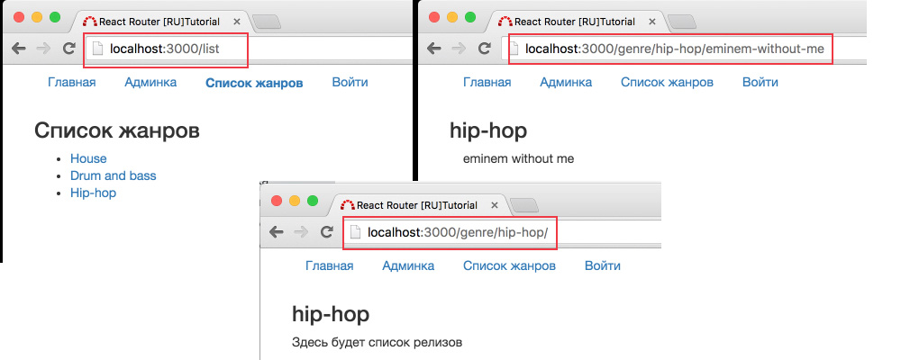

# Подготовка

Какие обычно стоят задачи из области "роутинга"?

1. Доступ к разным "страницам/разделам" - а если быть точным, к разным состояниям приложения, так как мы разрабатываем SPA (single page application - одностраничное приложение). Для простоты продолжим употреблять слова страница/раздел и подобные.
2. Разделение прав доступа: гости не могут зайти на страницу "/admin", а администратор может.
3. Редиректы.
4. 404 страница

Предлагаю сделать очень примитивный музыкальный каталог:

- есть список всех жанров
- есть страница релиза (в нашем случае - "трэка/песни")
- есть страница релизов данного жанра



## Структура сайта

```
/ - главная страница
/list - список жанров
/genre/:genre/ - список релизов данного жанра
/genre/:genre/:release - информация о релизе
/admin - страница администратора
```

Если в URL-адресе есть параметр (двоеточие + слово) значит такой адрес является динамическим. То есть, может быть таким: `/house/release/avicii-the-nights`, где `house` - музыкальный жанр, а `avicii-the-nights` - название релиза.

P.S. в реальном мире, релиз может содержать больше одного трэка. Пример настоящего релиза - [здесь](https://pro.beatport.com/release/the-days-and-the-nights/1428740).

## Начальная структура директорий и некоторых файлов

```
+-- bin
+-- src
|   +-- components
|   +-- containers
|   +-- index.js
+-- webpack
+-- index.html
+-- package.json
+-- server.js
```
