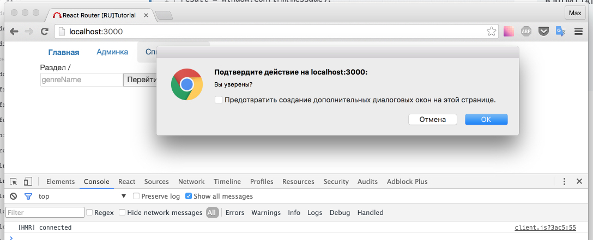

# Подтверждение перехода

Страница `Home/index.js` - уже зарекомендовала себя в качестве страницы для "выдуманных примеров". Сделаем еще один.

Представьте ситуацию, что вам нужно спросить у пользователя подтверждение о переходе. Самый распространенный вариант - редактирование каких-то данных -> клик на ссылку -> "вы уверены что хотите перейти, все изменения будут утеряны" -> да/нет.

В нашем, упрощенном примере, мы просто покажем confirm окно, на любой переход с главной страницы.

_src/components/Home/index.js_

```js
...
componentDidMount() {
    this.context.router.setRouteLeaveHook(this.props.route, this.routerWillLeave)
}
routerWillLeave() {
    let answer = window.confirm('Вы уверены?')
    if (!answer) return false
}
...
```



Так же, можно использовать более краткую запись в функции `routerWillLeave`:

```js
routerWillLeave() {
    return 'Вы уверены?'
}
```

Я надеюсь, что всем понятно: вместо стандартного confirm-окна, мы можем показать свои формочки и прочее... Главное, что мы должны вернуть `false`, если не хотим перехода.

Обратите внимание: если вы попробуете, находясь на главной странице, вписать адрес вручную и нажать enter - переход произойдет без вопросов.

Итого: научились предотвращать нежелательный переход по клику.

[Исходный код](https://github.com/maxfarseer/react-router-ru-tutorial/tree/prevent_navigate) на данный момент.
