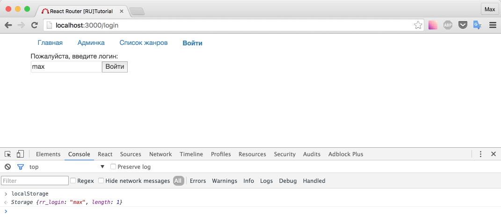

# Разделение доступа

В данном разделе, по шагам будет разобран вход на сайт в качестве администратора. Следовательно, мы сделаем недоступным для посещения адрес `localhost:3000/admin`, а так же рассмотрим редирект на "главную" или в "админку" после ввода логина.

Создадим страницу логина.

В качестве "сервера для авторизации", будем использовать [localStorage](https://developer.mozilla.org/ru/docs/Web/API/Window/localStorage).

Алгоритм простой: вводится логин - кладется в localStorage.

_src/components/Login/index.js_

```js
import React, { Component } from 'react'

export default class Login extends Component {
  handleSubmit(e) {
    e.preventDefault()
    const value = e.target.elements[0].value
    window.localStorage.setItem('rr_login', value)
  }
  render() {
    return (
      <div className="row">
        <div className="col-md-12">
          Пожалуйста, введите логин:
        </div>
        <form
          className="col-md-4"
          onSubmit={this.handleSubmit}
        >
          <input type="text" placeholder="login" />
          <button type="submit">Войти</button>
        </form>
      </div>
    )
  }
}
```

_src/routes.js_

```js
...
import Login from './components/Login'
...
<Route path='/login' component={Login} />
...
```

_src/containers/App/index.js_

```
...
<li><NavLink to='/login'>Войти</NavLink></li>
...
```

Напоминаю: несмотря на то, что ссылка появилась в шапке (hot-reload работает для компонента `<App />`), страницу все равно нужно перезагрузить (так как hot-reload не работает для обновления списка роутов).



Если ввести новый "логин" - старый перетирается. Данное допущение сейчас не мешает нам проверить работоспособность, а наоборот облегчает проверку.

Нам необходимо закрыть доступ "не админам", для этого потребуется разобрать "события", которые возникают в процессе изменений URL'a.

## onEnter, onLeave

Предлагаю добавить слово "хук" в словарь. По-моему, хук, не что иное как "действие на событие".

Итак, есть возможность использовать хуки на события `onLeave` и `onEnter`. По названию понятно: onLeave возникает, когда "роут покинут", а `onEnter` - в момент "захожу на роут".

Представьте адрес:

```
react-site.com/profile/photos/
```

его "роутер-реализацию": (не стоит так говорить в приличном месте)

```
/ + profile + photos
```

и его реализацию компонентами:

```
<App /> + <Profile /> + <Photos />
```

Представьте, что вы будучи на странице с фото, кликнули на ссылку для перехода на главную страницу. Произойдет:

- onLeave на /profile/photos
- onLeave на /profile
- onEnter на /

И обратная ситуация: вы находитесь на главной, и решили перейти в раздел фото:

- onLeave на /
- onEnter на /profile
- onEnter на /profile/photos

Вернемся к "хукам".

Добавьте в `routes.js` функцию `checkLogin` и непосредственно сам хук.

_src/routes.js_

```js
...
function checkLogin() {
  const login = window.localStorage.getItem('rr_login')
  if (login === 'admin') {
    console.log('пропусти')
  }
}
...
<Route path='/admin' component={Admin} onEnter={checkLogin}/>
...
```

Теперь если вы залогинетесь как `admin` - в консоли браузера вас "пропустят". Причем, заметьте, хук сработает при вводе url напрямую в строке ввода адреса + enter, либо если вы кликнете по ссылке. Так же, если вы уже находитесь в разделе admin и попробуете кликнуть на ссылку "Админка" - `onEnter` не произойдет, а следовательно и хук не сработает. Кажется, разработчики react-router'a постарались на славу.


На всякий случай, напоминаю, что очистить `localStorage` можно командой `localStorage.clear()`

У хука есть полезные аргументы - `nextState`, `replace`, `callback`. Нам понадобится `replace`. На пару слов подробнее можно прочитать в офф.документации.

Перепишем функцию `checkLogin`

_src/routes.js_

```js
...
function checkLogin(nextState, replace) {
  const login = window.localStorage.getItem('rr_login')
  if (login !== 'admin') {
    replace('/')
  }
}
...
```

Попробуйте сейчас залогиниться под другим именем: вы не сможете войти на страницу `/admin`, независимо от того введете ли вы адрес и нажмете enter, или кликните по ссылке.

Страницу [API Reference](https://github.com/reactjs/react-router/blob/master/docs/API.md) настоятельно рекомендую добавить в закладки.

## Использование static method в качестве хука на onEnter

Наш код работает, но функция `checkLogin`, как будто мешается в файле с роутами. Может быть вынести ее в отдельный файл? А вы знаете, есть еще одно интересное решение: использовать static метод класса Admin.

_src/components/Admin/index.js_

```js
import React, { Component } from 'react'

export default class Admin extends Component {
  static onEnter(nextState, replace) {
    const login = window.localStorage.getItem('rr_login')
    if (login !== 'admin') {
      replace('/')
    }
  }
  render() {
    return (
      <div className="row">
        <div className="col-md-12">Раздел /admin</div>
      </div>
    )
  }
}
```

Исправим `routes.js` (привожу полный листинг)

_src/routes.js_

```js
import React from 'react'
import { Route, IndexRoute } from 'react-router'

import App from './containers/App'
import Admin from './components/Admin'
import List from './components/List'
import Genre from './components/Genre'
import Release from './components/Release'
import Home from './components/Home'
import Login from './components/Login'
import NotFound from './components/NotFound'

export const routes = (
  <div>
    <Route path="/" component={App}>
      <IndexRoute component={Home} />
      {/* в качестве хука на onEnter - статический метод класса Admin */}
      <Route
        path="/admin"
        component={Admin}
        onEnter={Admin.onEnter}
      />
      <Route path="/genre/:genre" component={Genre}>
        <Route
          path="/genre/:genre/:release"
          component={Release}
        />
      </Route>
      <Route path="/list" component={List} />
      <Route path="/login" component={Login} />
    </Route>
    <Route path="*" component={NotFound} />
  </div>
)
```

Все, теперь с чистой совестью можете приступать к задачке на повторение.

Задача: если пользователь ввел admin - после нажатия кнопки "Войти" - направить его на /admin, иначе на /

Подсказка #1: Если данная задача вызвала у вас трудность, прочитайте еще раз [предыдущую главу](programmiruem_perehodi.md).

Решение:

_src/components/Login/index.js_

```js
import React, { Component, PropTypes } from 'react'

export default class Login extends Component {
  constructor() {
    super()
    this.handleSubmit = this.handleSubmit.bind(this)
  }
  handleSubmit(e) {
    e.preventDefault()
    const login = e.target.elements[0].value
    window.localStorage.setItem('rr_login', login)

    if (login === 'admin') {
      this.context.router.push('/admin')
    } else {
      this.context.router.push('/')
    }
  }
  render() {
    return (
      <div className="row">
        <div className="col-md-12">
          Пожалуйста, введите логин:
        </div>
        <form
          className="col-md-4"
          onSubmit={this.handleSubmit}
        >
          <input type="text" placeholder="login" />
          <button type="submit">Войти</button>
        </form>
      </div>
    )
  }
}

Login.contextTypes = {
  router: PropTypes.object.isRequired,
}
```

Итого: мы познакомились с возможностью "вклиниваться" в процесс роутинга. Разобрали рабочую ситуацию: как ограничить доступ юзеру в раздел администратора. Закрепили знания по программной навигации.

[Исходный код](https://github.com/maxfarseer/react-router-ru-tutorial/tree/url_access) на данный момент.
