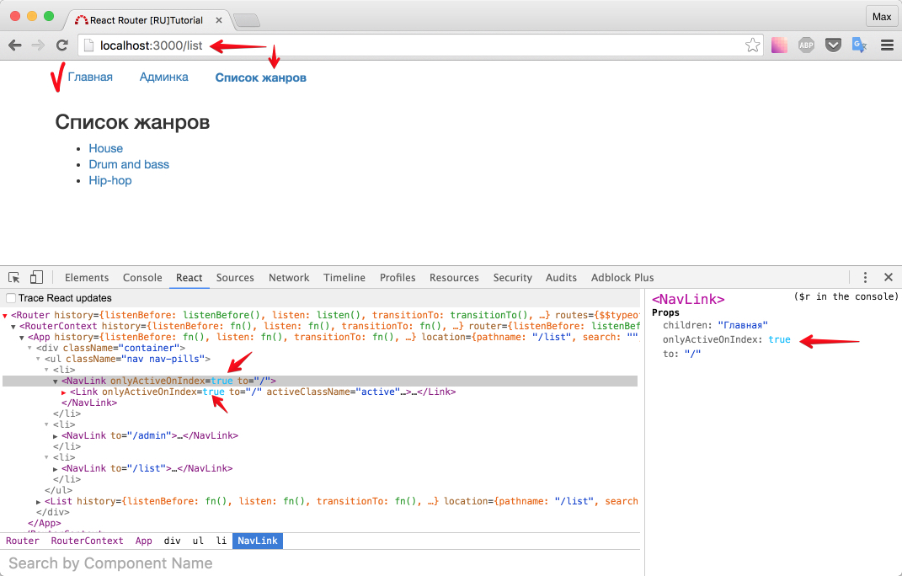
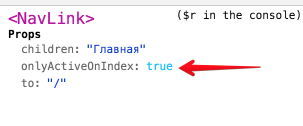

# Ссылка на главную

Перед нами простая задача - добавить ссылку на главную. Это навигационная ссылка? Да. Значит используем `<NavLink />`

_src/containers/App/index.js_

```js
import React, { Component } from 'react'
import NavLink from '../../components/NavLink'

export default class App extends Component {
  render() {
    return (
      <div className="container">
        <ul className="nav nav-pills">
          {/* добавили ссылку на главную страницу */}
          <li>
            <NavLink to="/">Главная</NavLink>
          </li>
          <li>
            <NavLink to="/admin">Админка</NavLink>
          </li>
          <li>
            <NavLink to="/list">Список жанров</NavLink>
          </li>
        </ul>
        {this.props.children}
      </div>
    )
  }
}
```

Посмотрим в браузере:


Тот самый случай, когда проблема решается без документации с помощью "инспектора" (вкладки React в консоли хрома). Видим свойство - `onlyActiveOnIndex: false`

Исправляем:

_src/containers/App/index.js_

```js
...
<li><NavLink onlyActiveOnIndex={true} to='/'>Главная</NavLink></li>
...
```

Проверим:



Отлично.

По умолчанию `onlyActiveOnIndex - false`. Поэтому, так как адрес у нас состоял из двух активных роутов ( `/` + `list` ) оба компонента `<Link />` получили класс `.active`

В качестве бонуса вопрос: мы прописали `onlyActiveOnIndex` для нашего компонента `<NavLink />`, как `<Link />` узнал, что свойство `onlyActiveOnIndex = true` ?

Ответ: Все благодаря тому, что мы использовали spread operator. Вспомним подробнее строку из файла `src/components/NavLink/index.js`:

```js
return <Link {...this.props} activeClassName="active" />
```

Запись `{...this.props}` означает "возьми все свойства" (возьми все `props`).



Позже мы добавляем ко всем полученным свойствам еще одно - activeClassName.

Кстати, если нажать на "Главная" - ссылка подсветится. Это тоже результат работы - onlyActiveOnIndex

Итого: мы научились подсвечивать "ссылку на главную" без ущерба для остальной навигации.

[Исходный код](https://github.com/maxfarseer/react-router-ru-tutorial/tree/index_link) на данный момент.
