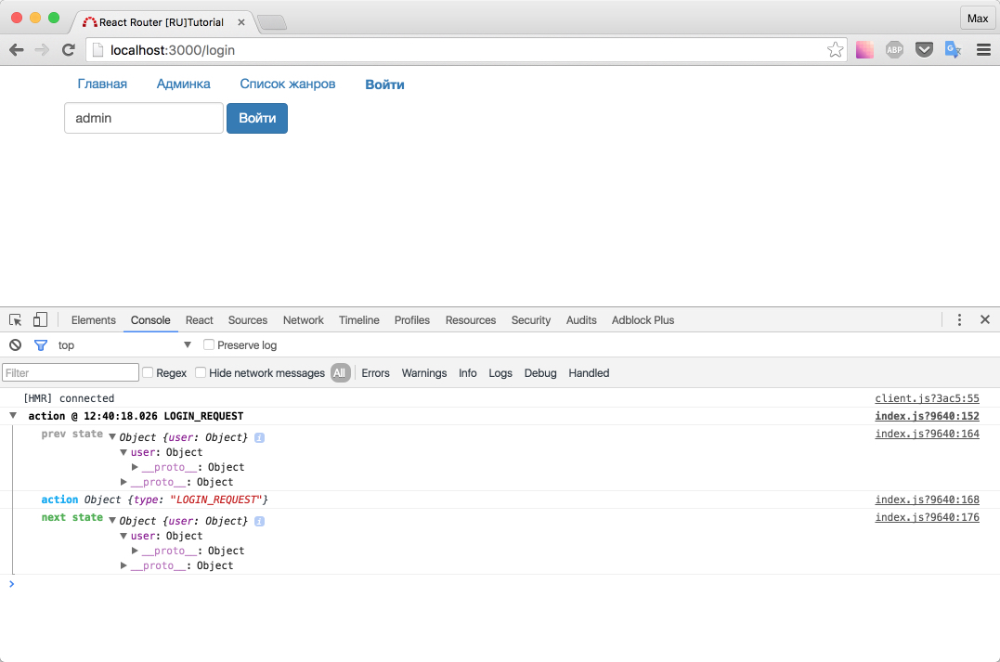
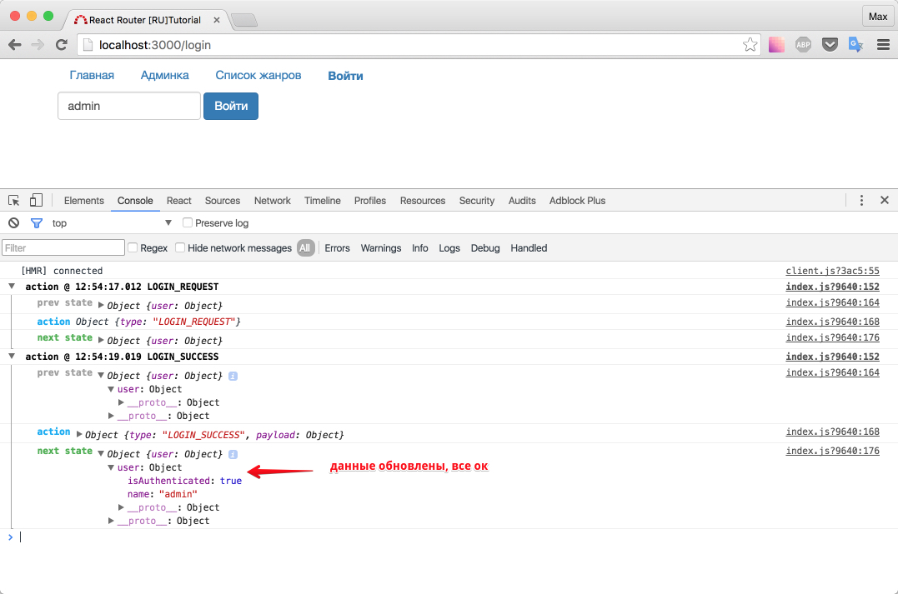
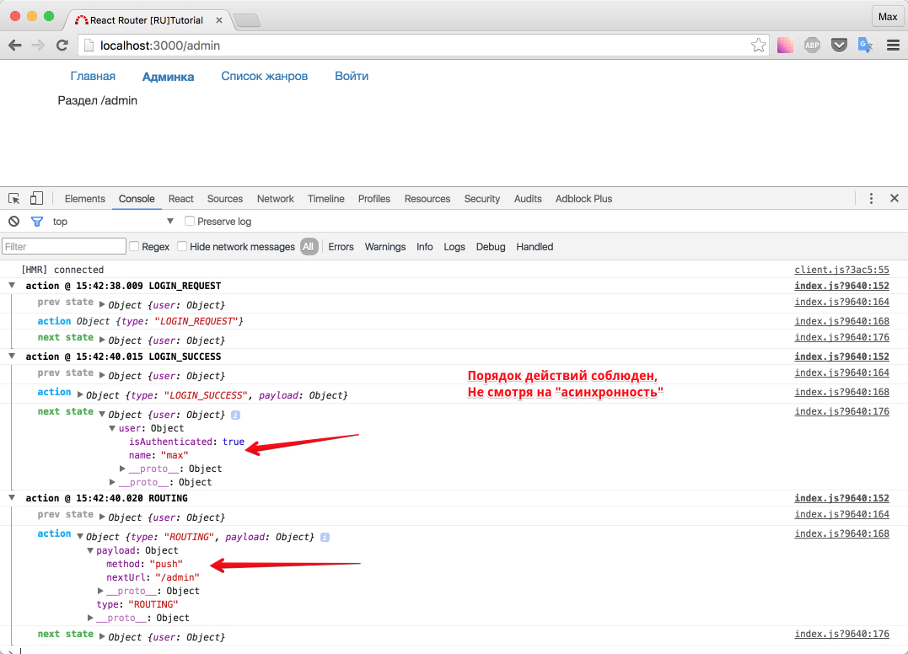

# store.dispatch редирект

Данная глава неспроста называется store.dispatch редирект. Пожалуй, факт, что мы должны выполнить редирект с помощью `store.dispatch` - является основополагающим в этом подходе.

Чего мы добьемся в таком случае?

Мы не нарушим однонаправленный (и самое важное, четко контролируемый нами) поток данных в приложении. По сути, весь роутинг - это действия (actions).

Большинство библиотек (`redux-router`, `react-router-redux`) так и поступают. В них, каждое действие можно увидеть в логах.

Почему здесь, я не хочу разбирать эти отличные библиотеки? Потому что, я хочу показать вам как сделать редирект "вручную", чтобы вы четко понимали как это работает. Да, мы потеряем связь с redux-devtools (в данном курсе не используется), да мы не будем "синхронизировать" данные роутера в store... Но так ли это важно и необходимо?

Давайте просто будем использовать react-router напрямую. А в лог писать, только те действия с роутингом, которые нам действительно необходимы.

Напоминаю, что предыдущий исходный код, дал следующий результат: если мы пытаемся залогиниться - логируется `LOGIN_REQUEST` и ничего не происходит.



Для начала, оформим все необходимое для имитации логина. В "заглушке" будем, помимо свойства name, добавлять свойство `isAuthenticated`

_src/actions/UserActions.js_

```js
...
export function login(payload) {
  return (dispatch) => {

    dispatch({
      type: LOGIN_REQUEST
    })

    setTimeout(() => {
      dispatch({
        type: LOGIN_SUCCESS,
        payload: {
          name: payload.name,
          isAuthenticated: true
        }
      })
    },2000)
  }
}
...
```

В редьюсере, соответственно, будем корректно обрабатывать измененный action:

_src/reducers_

```js
...
case LOGIN_SUCCESS:
      return {...state, name: action.payload.name, isAuthenticated: action.payload.isAuthenticated}
...
```

На всякий случай: `...` в начале и в конце = "другой код выше / ниже", а `...` в строке `return` - spread operator

Проверим:



LocalStorage в данный момент никак не используем.

Немного порассуждаем: если бы у нас была возможность "диспатчить" редирект, где бы мы это сделали? Очевидно, что после `LOGIN_SUCCESS` в таймауте.

Проблема в том, что мы не можем вызывать редирект, с помощью `store.dispatch`

Вопрос: как это исправить?

Ответ: написать middleware.

Задача: требуется написать middleware, который в случае: `action.type = РОУТИНГ`, выполнял бы переход (с помощью browserHistory, разумеется).

Дополнение #1: Было бы здорово, если бы мы имели возможность указывать push или replaceState метод.

Решение (псевдо-код):

```
import browserHistory
import КОНСТАНТА_РОУТИНГА

export const redirect = store => next => action => {
  if (action.type === КОНСТАНТА_РОУТИНГА) {
    browserHistory[МЕТОД](куда_перенаправить)
  }

  return next(action)
}
```

Предлагаю решить самостоятельно, а после сверится с кодом ниже.

## Решение: создание middleware для роутинга

_src/constants/Routing.js_

```js
export const ROUTING = 'ROUTING'
```

_src/middlewares/redirect.js_

```js
import { browserHistory } from 'react-router'

import { ROUTING } from '../constants/Routing'

export const redirect = (store) => (next) => (action) => {
  //eslint-disable-line no-unused-vars
  if (action.type === ROUTING) {
    browserHistory[action.payload.method](
      action.payload.nextUrl
    )
  }

  return next(action)
}
```

События связанные с роутингом мы не будем обрабатывать редьюсером.

Обновим actionCreator (функцию-создатель действия):

_src/actions/UserActions.js_

```js
...
import {
  ROUTING
} from '../constants/Routing'

export function login(payload) {
  return (dispatch) => {

    dispatch({
      type: LOGIN_REQUEST
    })

    setTimeout(() => {
      dispatch({
        type: LOGIN_SUCCESS,
        payload: {
          name: payload.name,
          isAuthenticated: true
        }
      })

      dispatch({
        type: ROUTING,
        payload: {
          method: 'push', //или, например, replace
          nextUrl: '/admin'
        }
      })
    },2000)
  }
}
...
```

Вопрос: где мы должны добавить middleware в цепочку других middleware'ов ?

Ответ: там, где настраивается объект store

_src/store/configureStore.js_

```js
...
import { redirect } from '../middlewares/redirect'

export default function configureStore() {
  const store = compose(
    applyMiddleware(thunkMiddleware),
    applyMiddleware(createLogger()),
    applyMiddleware(redirect) // добавили редирект middleware
  )(createStore)(rootReducer)
...
```

Очистим метод `onEnter` у компонента `<Admin />`:

_src/components/Admin/index.js_

```js
import React, { Component } from 'react'

export default class Admin extends Component {
  static onEnter() {
    // nothing
  }
  render() {
    return (
      <div className="row">
        <div className="col-md-12">Раздел /admin</div>
      </div>
    )
  }
}
```

Откройте в браузере `http://localhost:3000/login` и попробуйте залогиниться (введите любое имя):



Теперь нажмите "назад" - вы должны оказаться на странице `/login`, так как мы использовали метод push. Данный метод добавляет страницу в историю браузера. replace же, не добавляет страницу в историю браузера, но тем не менее url меняет. Скоро мы поработаем с ним.

Не забывайте про возможность пользователя нажимать "назад/вперед".

Итог: мы научились делать редирект посредством store.dispatch, но сломали onEnter hook, теперь страница `/admin` доступна всегда. Исправим это в следующем уроке.

[Исходный код](https://github.com/maxfarseer/react-router-ru-tutorial/tree/middleware_redirect_v2) на данный момент.
