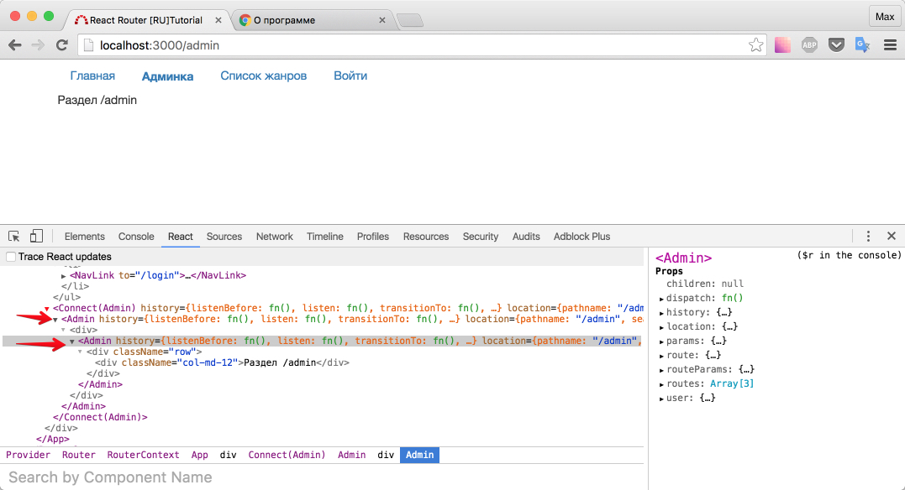
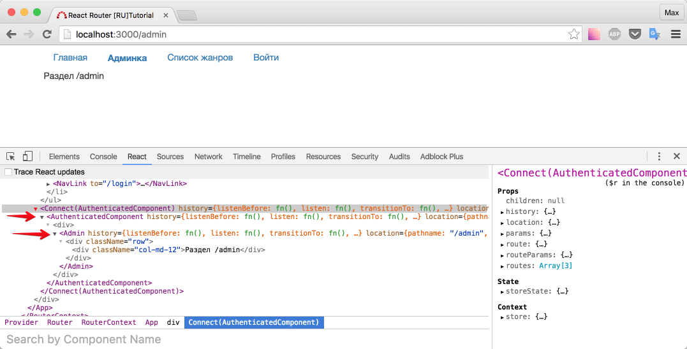

# "Закрытый" компонент

Для урока, я использовал [этот](https://github.com/joshgeller/react-redux-jwt-auth-example/blob/master/src/components/AuthenticatedComponent.js) пример.

В конце прошлого раздела у нас осталась проблема - все имеют доступ к `/admin`. Мы уже решали ее в первой части с помощью хука на `onEnter`. Но для связки redux + react-router мне нравится подход с "закрытым" компонентом.

Помните, мы делали `<NavLink />` обертку? Как я уже писал - это очень мощный прием. Сейчас мы воспользуемся этим приемом еще раз.

## AuthenticatedComponent

Начнем с размышлений и псевдокода:

*Закрытый*компонент.js\_

```js
...
render() {
    this.props.юзер_может_видеть_это
    ? <Компонент_который_закрыт + его props />
    : ничего
}
...
```

Что ж, выглядит "заумно"? На деле - воспользуемся старой доброй возможностью прокидывать аргументы в функцию. А так же, сразу сделаем нашу обертку "приконекченной" (connect).

_src/containers/AuthenticatedComponent/index.js_

```js
import React, { Component } from 'react'
import { connect } from 'react-redux'

export default function requireAuthentication(Component) {
  class AuthenticatedComponent extends Component {
    render() {
      return (
        <div>
          {this.props.user.isAuthenticated === true ? (
            <Component {...this.props} />
          ) : null}
        </div>
      )
    }
  }

  function mapStateToProps(state) {
    return {
      user: state.user,
    }
  }

  return connect(mapStateToProps)(AuthenticatedComponent)
}
```

В `render` методе мы проверяем - есть ли у user право видеть данный компонент, и если да - показываем. Если нет - `null`.

Обновим роуты:

_src/routes.js_

```js
...
import requireAuthentication from './containers/AuthenticatedComponent'

...
<Route path='/' component={App}>
<IndexRoute component={Home} />
<Route path='/admin' component={requireAuthentication(Admin)} /> // Admin -> <Component {...this.props} />
...
```

Опять же, почувствуйте все удобства "оборачивания": нам вообще не нужно ничего делать с компонентом `<Admin />`.

Перекур. Интересный момент. На дворе 22.04.2016 и мой хром версии - 50.0.2661.75 (64-bit) + React dev tools последней версии.

Давайте проверим как работает наш подход. Зайдите на `/login`, залогиньтесь и после редиректа посмотрите в инспектор:



Выглядит не так, как мы ожидали. Вероятно, должно было быть так:

```
connect(AuthenticatedComponent)
>> AuthenticatedComponent
>> >> Admin
```

Но у нас:

```
connect(Admin)
>> Admin
>> >> Admin
```

До текущего момента мы сделали очень много работы, чтобы все работало так как мы ожидаем, не так ли? Если мы пишем `console.log` - у нас возникает один `console.log` (камень в огород Angular), если мы хотим чтобы "роутинг" был частью потока данных - мы и это делаем в соответствии с документацией. Тогда в чем дело?

Посмотрите внимательно на код `AuthenticatedComponent`. У нас и аргумент функции `Component` и класс наследует `Component`. Вероятно, проблема здесь. Давайте просто импортируем чуть-чуть иначе, а название аргумента сохраним.

_src/containers/AuthenticatedComponent/index.js_

```js
import React from 'react'
import { connect } from 'react-redux'

export default function requireAuthentication(Component) {
  class AuthenticatedComponent extends React.Component {
    render() {
      return (
        <div>
          {this.props.user.isAuthenticated === true ? (
            <Component {...this.props} />
          ) : null}
        </div>
      )
    }
  }

  function mapStateToProps(state) {
    return {
      user: state.user,
    }
  }

  return connect(mapStateToProps)(AuthenticatedComponent)
}
```

Проверим:



Ожидаемо и предсказуемо. Перекур завершен.

P.S. было "extends Component", стало "extends React.Component" (конечно, строка импорта тоже изменилась)

## Редирект на страницу логина, если пользователь не аутентифицирован

Мы почти закончили. На данный момент:

- после логина - редирект
- при попытке неавторизованному пользователю зайти на `/admin` - пусто (вместо `null` можете выводить "403 - доступ запрещен", либо можете создать компонент `<NoAccess />` ...)

Тем не менее, по условию задачи: если пользователь неавторизован - перенаправь его на `/login`.

Для этого воспользуемся lifecycle-методами (методами жизненого цикла): `componentWillMount` и `componentWillReceiveProps`

_src/containers/AuthenticatedComponent/index.js_

```js
import React from 'react'
import { connect } from 'react-redux'
import { ROUTING } from '../../constants/Routing'

export function requireAuthentication(Component) {
  class AuthenticatedComponent extends React.Component {
    componentWillMount() {
      this.checkAuth(this.props.user)
    }
    componentWillReceiveProps(nextProps) {
      this.checkAuth(nextProps.user)
    }
    checkAuth(user) {
      if (!user.isAuthenticated) {
        this.props.dispatch({
          type: ROUTING,
          payload: {
            method: 'replace',
            nextUrl: '/login',
          },
        })
      }
    }
    render() {
      return (
        <div>
          {this.props.user.isAuthenticated === true ? (
            <Component {...this.props} />
          ) : null}
        </div>
      )
    }
  }

  function mapStateToProps(state) {
    return {
      user: state.user,
    }
  }

  return connect(mapStateToProps)(AuthenticatedComponent)
}
```

Поскольку, `AuthenticatedComponent` присоединен, у нас есть возможность использовать `this.props.dispatch`.

Для истории браузера используется метод replace, так как нам это подходит лучше (после проверки, замените на push и походите "Назад/Вперед").

Измените на replace и в UserActions.

_src/actions/UserActions.js_

```js
...
dispatch({
type: ROUTING,
payload: {
method: 'replace',
nextUrl: '/admin'
}
})
...
```

Проверьте в браузере.

Итого: мы рассмотрели еще один пример "оборачивания" компонента, тем самым получив необходимый для решения задачи редирект.

P.S. вы можете использовать "оборачивание", для скрытия каких-то элементов на странице, а не только всей страницы целиком.

[Исходный код](https://github.com/maxfarseer/react-router-ru-tutorial/tree/authenticated_component) на данный момент.
