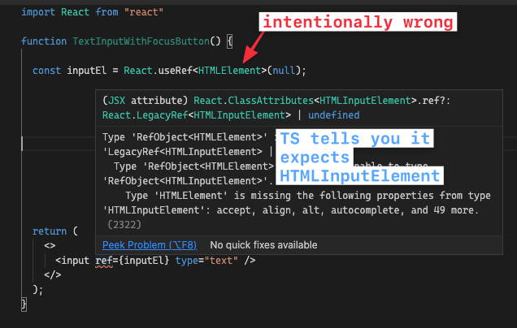

# Хуки

Хуки [поддерживаются в `@types/react` с v16.8 и выше](https://github.com/DefinitelyTyped/DefinitelyTyped/blob/a05cc538a42243c632f054e42eab483ebf1560ab/types/react/index.d.ts#L800-L1031).

## useState

Вывод типа очень хорошо работает для простых значений:

```ts
const [state, setState] = useState(false);
// `state` предположительно является булевой величиной
// `setState` принимает только булевы значения
```

См. также раздел [Использование выводных типов](../troubleshooting/types.md#using-inferred-types), если вам нужно использовать сложный тип, для которого вы полагались на вывод.

Однако многие хуки инициализируются нулевыми значениями по умолчанию, и вы можете задаться вопросом, как предоставить типы. Явно объявите тип и используйте тип объединения:

```ts
const [user, setUser] = useState<User | null>(null);

// позже...
setUser(newUser);
```

Вы также можете использовать утверждения типов, если состояние инициализируется вскоре после установки и всегда имеет значение после:

```ts
const [user, setUser] = useState<User>({} as User);

// позже...
setUser(newUser);
```

Это временно "обманывает" компилятор TypeScript, что `{}` имеет тип `User`. После этого следует установить состояние `user` - если этого не сделать, остальная часть вашего кода может полагаться на то, что `user` имеет тип `User`, что может привести к ошибкам во время выполнения.

## useCallback

Вы можете набрать `useCallback` так же, как и любую другую функцию.

```ts
const memoizedCallback = useCallback(
    (param1: string, param2: number) => {
        console.log(param1, param2);
        return { ok: true };
    },
    [
        /*...*/
    ]
);
/**
 * VSCode покажет следующий тип:
 * const memoizedCallback:
 *  (param1: string, param2: number) => { ok: boolean }
 */
```

Обратите внимание, что для React &lt; 18 сигнатура функции `useCallback` по умолчанию типизирует аргументы как `any[]`:

```ts
function useCallback<T extends (...args: any[]) => any>(
    callback: T,
    deps: DependencyList
): T;
```

В React >= 18 сигнатура функции `useCallback` изменилась на следующую:

```ts
function useCallback<T extends Function>(
    callback: T,
    deps: DependencyList
): T;
```

Поэтому следующий код выдаст ошибку "`Parameter 'e' implicitly has an 'any' type.`" в React >= 18, но не в &lt; 17.

```ts
// @ts-expect-error Parameter 'e' implicitly has 'any' type.
useCallback((e) => {}, []);
// Explicit 'any' type.
useCallback((e: any) => {}, []);
```

## useReducer

Вы можете использовать [Discriminated Unions](https://www.typescriptlang.org/docs/handbook/typescript-in-5-minutes-func.html#discriminated-unions) для действий редуктора. Не забудьте определить возвращаемый тип редуктора, иначе TypeScript вычислит его.

```ts
import { useReducer } from 'react';

const initialState = { count: 0 };

type ACTIONTYPE =
    | { type: 'increment'; payload: number }
    | { type: 'decrement'; payload: string };

function reducer(
    state: typeof initialState,
    action: ACTIONTYPE
) {
    switch (action.type) {
        case 'increment':
            return { count: state.count + action.payload };
        case 'decrement':
            return {
                count: state.count - Number(action.payload),
            };
        default:
            throw new Error();
    }
}

function Counter() {
    const [state, dispatch] = useReducer(
        reducer,
        initialState
    );
    return (
        <>
            Count: {state.count}
            <button
                onClick={() =>
                    dispatch({
                        type: 'decrement',
                        payload: '5',
                    })
                }
            >
                -
            </button>
            <button
                onClick={() =>
                    dispatch({
                        type: 'increment',
                        payload: 5,
                    })
                }
            >
                +
            </button>
        </>
    );
}
```

[Открыть в TypeScript Playground](https://www.typescriptlang.org/play?#code/LAKFEsFsAcHsCcAuACAVMghgZ2QJQKYYDGKAZvLJMgOTyEnUDcooRsAdliuO+IuBgA2AZUQZE+ZAF5kAbzYBXdogBcyAAwBfZmBCIAntEkBBAMIAVAJIB5AHLmAmgAUAotOShkyAD5zkBozVqHiI6SHxlagAaZGgMfUFYDAATNXYFSAAjfHhNDxAvX1l-Q3wg5PxQ-HDImLiEpNTkLngeAHM8ll1SJRJwDmQ6ZIUiHIAKLnEykqNYUmQePgERMQkY4n4ONTMrO0dXAEo5T2aAdz4iAAtkMY3+9gA6APwj2ROvImxJYPYqmsRqCp3l5BvhEAp4Ow5IplGpJhIHjCUABqTB9DgPeqJFLaYGfLDfCp-CIAoEFEFeOjgyHQ2BKVTNVb4RF05TIAC0yFsGWy8Fu6MeWMaB1x5K8FVIGAUglUwK8iEuFFOyHY+GVLngFD5Bx0Xk0oH13V6myhplZEm1x3JbE4KAA2vD8DFkuAsHFEFcALruAgbB4KAkEYajPlDEY5GKLfhCURTHUnKkQqFjYEAHgAfHLkGb6WpZI6WfTDRSvKnMgpEIgBhxTIJwEQANZSWRjI5SdPIF1u8RXMayZ7lSphEnRWLxbFNagAVmomhF6fZqYA9OXKxxM2KQWWK1WoTW643m63pB2u+7e-3SkEQsPamOGik1FO55p08jl6vdxuKcvv8h4yAmhAA)

!!!info "Использование с `Reducer` из `redux`"

    Если вы используете библиотеку [redux](https://github.com/reduxjs/redux) для написания функции reducer, она предоставляет удобный помощник формата `Reducer<State, Action>`, который позаботится о типе возврата за вас.

    Таким образом, приведенный выше пример reducer превращается в:

    ```ts
    import { Reducer } from 'redux';

    export function reducer: Reducer<AppState, Action>() {}
    ```

## useEffect / useLayoutEffect

И `useEffect`, и `useLayoutEffect` используются для выполнения **побочных эффектов** и возвращают необязательную функцию очистки, что означает, что если они не имеют дело с возвратом значений, то никакие типы не нужны. При использовании `useEffect` следите за тем, чтобы не возвращать ничего, кроме функции или `undefined`, иначе TypeScript и React будут на вас кричать. Это может быть очень тонко при использовании стрелочных функций:

```ts
function DelayedEffect(props: { timerMs: number }) {
    const { timerMs } = props;

    useEffect(
        () =>
            setTimeout(() => {
                /* do stuff */
            }, timerMs),
        [timerMs]
    );
    // bad example! setTimeout implicitly returns a number
    // because the arrow function body isn't wrapped in curly braces
    return null;
}
```

!!!info "Решение приведенного выше примера"

    ```ts
    function DelayedEffect(props: { timerMs: number }) {
    	const { timerMs } = props;

    	useEffect(() => {
    		setTimeout(() => {
    			/* do stuff */
    		}, timerMs);
    	}, [timerMs]);
    	// better; use the void keyword to make sure you return undefined
    	return null;
    }
    ```

## useRef

В TypeScript `useRef` возвращает ссылку, которая является либо [read-only](https://github.com/DefinitelyTyped/DefinitelyTyped/blob/abd69803c1b710db58d511f4544ec1b70bc9077c/types/react/v16/index.d.ts#L1025-L1039), либо [mutable](https://github.com/DefinitelyTyped/DefinitelyTyped/blob/abd69803c1b710db58d511f4544ec1b70bc9077c/types/react/v16/index.d.ts#L1012-L1023), в зависимости от того, полностью ли ваш аргумент типа покрывает начальное значение или нет. Выберите тот вариант, который подходит для вашего случая использования.

### Вариант 1: Ссылка на элемент DOM

**[Для доступа к элементу DOM](https://reactjs.org/docs/refs-and-the-dom.html):** в качестве аргумента укажите только тип элемента, а в качестве начального значения используйте `null`. В этом случае возвращаемая ссылка будет иметь доступное только для чтения значение `.current`, которым управляет React. TypeScript ожидает, что вы передадите эту ссылку в свойство `ref` элемента:

```ts
function Foo() {
    // - If possible, prefer as specific as possible. For example, HTMLDivElement
    //   is better than HTMLElement and way better than Element.
    // - Technical-wise, this returns RefObject<HTMLDivElement>
    const divRef = useRef<HTMLDivElement>(null);

    useEffect(() => {
        // Note that ref.current may be null. This is expected, because you may
        // conditionally render the ref-ed element, or you may forget to assign it
        if (!divRef.current)
            throw Error('divRef is not assigned');

        // Now divRef.current is sure to be HTMLDivElement
        doSomethingWith(divRef.current);
    });

    // Give the ref to an element so React can manage it for you
    return <div ref={divRef}>etc</div>;
}
```

Если вы уверены, что `divRef.current` никогда не будет равен `null`, можно также использовать оператор утверждения non-null `!`:

```ts
const divRef = useRef<HTMLDivElement>(null!);
// Later... No need to check if it is null
doSomethingWith(divRef.current);
```

Обратите внимание, что здесь вы отказываетесь от безопасности типов - вы получите ошибку во время выполнения, если забудете присвоить ссылку элементу при рендеринге, или если элемент с ссылкой будет отрендерен условно.

!!!note "Совет: Выбор `HTMLElement` для использования"

    Ссылки требуют конкретики - недостаточно просто указать любой старый `HTMLElement`. Если вы не знаете имя нужного вам типа элемента, вы можете проверить [lib.dom.ts](https://github.com/microsoft/TypeScript/blob/v3.9.5/lib/lib.dom.d.ts#L19224-L19343) или сделать намеренную ошибку типа и позволить языковой службе сообщить вам об этом:

    

### Вариант 2: Мутабельное значение

**[Чтобы иметь изменяемое значение](https://reactjs.org/docs/hooks-faq.html#is-there-something-like-instance-variables):** укажите тип, который вы хотите, и убедитесь, что начальное значение полностью принадлежит этому типу:

```ts
function Foo() {
    // Technical-wise, this returns MutableRefObject<number | null>
    const intervalRef = useRef<number | null>(null);

    // You manage the ref yourself (that's why
    // it's called MutableRefObject!)
    useEffect(() => {
        intervalRef.current = setInterval(/* ... */);
        return () => clearInterval(intervalRef.current);
    }, []);

    // The ref is not passed to any element's "ref" prop
    return (
        <button onClick={/* clearInterval the ref */}>
            Cancel timer
        </button>
    );
}
```

### См. также

-   [Связанный вопрос от @rajivpunjabi](https://github.com/typescript-cheatsheets/react/issues/388) - [Playground](https://www.typescriptlang.org/play#code/JYWwDg9gTgLgBAKjgQwM5wEoFNkGN4BmUEIcARFDvmQNwCwAUI7hAHarwCCYYcAvHAAUASn4A+OAG9GjOHAD0CBLLnKGcxHABiwKBzgQwMYGxS4WUACbBWAczgwIcSxFwBXEFlYxkxtgDoVTQBJVmBjZAAbOAA3KLcsOAB3YEjogCNE1jc0-zgAGQBPG3tHOAAVQrAsAGVcKGAjOHTCuDdUErhWNgBabLSUVFQsWBNWA2qoX2hA9VU4AGFKXyx0AFk3H3TIxOwCOAB5dIArLHwgpHcoSm84MGJJmFbgdG74ZcsDVkjC2Y01f7yFQsdjvLAEACM-EwVBg-naWD2AB4ABLlNb5GpgZCsACiO083jEgn6kQAhMJ6HMQfpKJCFpE2IkBNg8HCEci0RisTj8VhCTBiaSKVSVIoAaoLnBQuFgFFYvFEikBpkujkMps4FgAB7VfCdLmY7F4gleOFwAByEHg7U63VYfXVg2Go1MhhG0ygf3mAHVUtF6jgYLtwUdTvguta4Bstjs9mGznCpVcbvB7u7YM90B8vj9vYgLkDqWxaeCAEzQ1n4eHDTnoo2801EknqykyObii5SmpnNifA5GMZmCzWOwOJwudwC3xjKUyiLROKRBLJf3NLJO9KanV64xj0koVifQ08k38s1Sv0DJZBxIx5DbRGhk6J5Nua5mu4PEZPOAvSNgsgnxsHmXZzIgRZyDSYIEAAzJWsI1k+BCovWp58gKcAAD5qmkQqtqKHbyCexoYRecw7IQugcAs76ptCdIQv4KZmoRcjyMRaGkU28A4aSKiUXAwwgpYtEfrcAh0mWzF0ax7bsZx3Lceetx8eqAlYPAMAABa6KJskSXAdKwTJ4kwGxCjyKy-bfK05SrDA8mWVagHAbZeScOY0CjqUE6uOgqDaRAOSfKqOYgb8KiMaZ9GSeCEIMkyMVyUwRHWYc7nSvAgUQEk6AjMQXpReWyWGdFLHeBZHEuTCQEZT8xVwaV8BxZCzUWZQMDvuMghBHASJVnCWhTLYApiH1chIqgxpGeCfCSIxAC+Yj3o+8YvvgSLyNNOLjeBGhTTNdLzVJy3reGMBbTtrB7RoB3XbNBAneCsHLatcbPhdV3GrdB1WYhw3IKNZq-W2DCLYRO7QPAljgsgORcDwVJAA)
-   [Пример от Штефана Баумгартнера](https://fettblog.eu/typescript-react/hooks/#useref) - [Playground](https://www.typescriptlang.org/play/?jsx=2#code/JYWwDg9gTgLgBAJQKYEMDG8BmUIjgIilQ3wFgAoCzAVwDsNgJa4AVJADxgElaxqYA6sBgALAGIQ01AM4AhfjCYAKAJRwA3hThwA9DrjBaw4CgA2waUjgB3YSLi1qp0wBo4AI35wYSZ6wCeYEgAymhQwGDw1lYoRHCmEBAA1oYA5nCY0HAozAASLACyADI8fDAAoqZIIEi0MFpwaEzS8IZllXAAvIjEMAB0MkjImAA8+cWl-JXVtTAAfEqOzioA3A1NtC1wTPIwirQAwuZoSV1wql1zGg3aenAt4RgOTqaNIkgn0g5ISAAmcDJvBA3h9TsBMAZeFNXjl-lIoEQ6nAOBZ+jddPpPPAmGgrPDEfAUS1pG5hAYvhAITBAlZxiUoRUqjU6m5RIDhOi7iIUF9RFYaqIIP9MlJpABCOCAUHJ0eDzm1oXAAGSKyHtUx9fGzNSacjaPWq6Ea6gI2Z9EUyVRrXV6gC+DRtVu0RBgxuYSnRIzm6O06h0ACpIdlfr9jExSQyOkxTP5GjkPFZBv9bKIDYSmbNpH04ABNFD+CV+nR2636kby+BETCddTlyo27w0zr4HycfC6L0lvUjLH7baHY5Jas7BRMI7AE42uYSUXed6pkY6HtMDulnQruCrCg2oA)

## useImperativeHandle

Основываясь на этом [ответ на Stackoverflow](https://stackoverflow.com/a/69292925/5415299):

```ts
// Countdown.tsx

// Определите типы хэндлов, которые будут передаваться в forwardRef
export type CountdownHandle = {
    start: () => void;
};

type CountdownProps = {};

const Countdown = forwardRef<
    CountdownHandle,
    CountdownProps
>((props, ref) => {
    useImperativeHandle(ref, () => ({
        // В start() есть вывод типа
        start() {
            alert('Start');
        },
    }));

    return <div>Countdown</div>;
});
```

---

```ts
// Компонент использует компонент Countdown

import Countdown, {
    CountdownHandle,
} from './Countdown.tsx';

function App() {
    const countdownEl = useRef<CountdownHandle>(null);

    useEffect(() => {
        if (countdownEl.current) {
            // В start() также присутствует вывод типа
            countdownEl.current.start();
        }
    }, []);

    return <Countdown ref={countdownEl} />;
}
```

### См. также:

-   [Использование функции ForwardRefRenderFunction](https://stackoverflow.com/a/62258685/5415299)

## Пользовательские крючки

Если вы возвращаете массив в своем пользовательском хуке, вы захотите избежать вывода типов, так как TypeScript выведет тип объединения (когда на самом деле вам нужны разные типы в каждой позиции массива). Вместо этого используйте [TS 3.4 const assertions](https://devblogs.microsoft.com/typescript/announcing-typescript-3-4/#const-assertions):

```ts
import { useState } from 'react';

export function useLoading() {
    const [isLoading, setState] = useState(false);
    const load = (aPromise: Promise<any>) => {
        setState(true);
        return aPromise.finally(() => setState(false));
    };
    // infers [boolean, typeof load] instead of (boolean | typeof load)[]
    return [isLoading, load] as const;
}
```

[См. в TypeScript Playground](https://www.typescriptlang.org/play/?target=5&jsx=2#code/JYWwDg9gTgLgBAJQKYEMDG8BmUIjgcilQ3wFgAoCpAD0ljkwFcA7DYCZuRgZyQBkIKACbBmAcwAUASjgBvCnDhoO3eAG1g3AcNFiANHF4wAyjBQwkAXTgBeRMRgA6HklPmkEzCgA2vKQG4FJRV4b0EhWzgJFAAFHBBNJAAuODjcRIAeFGYATwA+GRs8uSDFIzcLCRgoRiQA0rgiGEYoTlj4xMdMUR9vHIlpW2Lys0qvXzr68kUAX0DpxqRm1rgNLXDdAzDhaxRuYOZVfzgAehO4UUwkKH21ACMICG9UZgMYHLAkCEw4baFrUSqVARb5RB5PF5wAA+cHen1BfykaksFBmQA)

Таким образом, при деструктуризации вы получите нужные типы в зависимости от позиции деструктуризации.

!!!info "Альтернатива: Утверждение типа возврата кортежа"

    Если у вас [возникают проблемы с утверждениями const](https://github.com/babel/babel/issues/9800), вы также можете утверждать или определять типы возврата функций:

    ```ts
    import { useState } from 'react';

    export function useLoading() {
    	const [isLoading, setState] = useState(false);
    	const load = (aPromise: Promise<any>) => {
    		setState(true);
    		return aPromise.finally(() => setState(false));
    	};
    	return [isLoading, load] as [
    		boolean,
    		(aPromise: Promise<any>) => Promise<any>
    	];
    }
    ```

    Вспомогательная функция, которая автоматически типизирует кортежи, также может быть полезна, если вы пишете много пользовательских хуков:

    ```ts
    function tuplify<T extends any[]>(...elements: T) {
    	return elements;
    }

    function useArray() {
    	const numberValue = useRef(3).current;
    	const functionValue = useRef(() => {}).current;
    	return [numberValue, functionValue]; // type is (number | (() => void))[]
    }

    function useTuple() {
    	const numberValue = useRef(3).current;
    	const functionValue = useRef(() => {}).current;
    	return tuplify(numberValue, functionValue); // type is [number, () => void]
    }
    ```

Обратите внимание, что команда React рекомендует, чтобы пользовательские хуки, возвращающие более двух значений, использовали соответствующие объекты, а не кортежи.

## Больше хуков + чтение TypeScript:

-   <https://medium.com/@jrwebdev/react-hooks-in-typescript-88fce7001d0d>
-   <https://fettblog.eu/typescript-react/hooks/#useref>

Если вы пишете библиотеку React Hooks, не забудьте, что вы также должны раскрыть ваши типы для использования пользователями.

## Пример React Hooks + TypeScript Libraries:

-   <https://github.com/mweststrate/use-st8>
-   <https://github.com/palmerhq/the-platform>
-   <https://github.com/sw-yx/hooks>

[Что-то добавить? Задать вопрос](https://github.com/typescript-cheatsheets/react/issues/new).

<small>:material-information-outline: Источник &mdash; <https://react-typescript-cheatsheet.netlify.app/docs/basic/getting-started/hooks></small>
